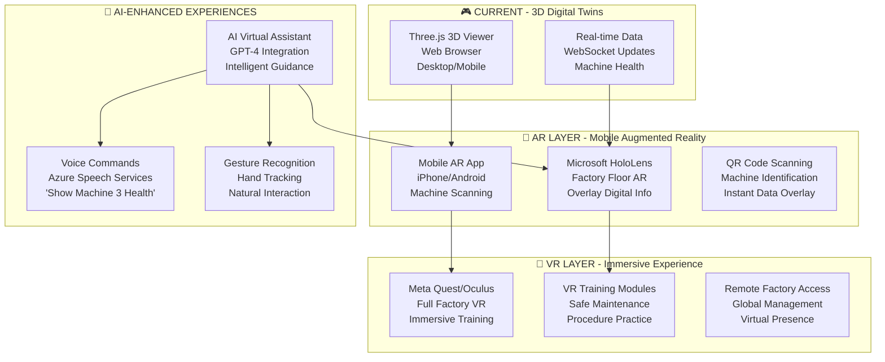

# 🏭 Smart Factory Case Study #36 - Architecture Diagram

## 🎯 **Current State - December 24, 2025**

```mermaid
graph TB
    %% Edge Layer (Azure Local)
    subgraph "🏭 AZURE LOCAL - Edge Computing"
        subgraph "🖥️ VM arc-simple (130.131.248.173)"
            VM[VM arc-simple<br/>🔴 Auto-shutdown @ 12:00<br/>Windows Server 2022]
            ARC[Azure Arc Agent<br/>Hybrid Management]
            FS[Factory Simulator<br/>Node.js + PowerShell<br/>4 Machines Telemetry]
            EDGE[IoT Edge Runtime<br/>Local Processing]
        end
    end

    %% Connectivity Layer
    subgraph "🌐 HYBRID CONNECTIVITY"
        VPN[🔒 Azure Arc Connection<br/>Secure Hybrid Bridge]
        VNET[🌐 VNet Integration<br/>azlocal-vnet (10.0.0.0/16)<br/>- VM Subnet: 10.0.1.0/24<br/>- IoT Subnet: 10.0.2.0/24<br/>- Functions Subnet: 10.0.3.0/24]
    end

    %% Azure Cloud Layer
    subgraph "☁️ AZURE CLOUD - Production Services"
        subgraph "📡 IoT & Messaging"
            IOT[Azure IoT Hub<br/>sf-iothub-demo<br/>Message Ingestion]
            EVENT[Event Hub Endpoint<br/>Built-in Routing]
        end
        
        subgraph "⚡ Processing & Intelligence"
            FUNC[Azure Functions<br/>sf-func-adt-demo<br/>IoT → ADT Projection]
            ML[Azure ML Workspace<br/>Predictive Models<br/>94.7% Accuracy]
        end
        
        subgraph "🔷 Digital Representation"
            ADT[Azure Digital Twins<br/>sf-adt-demo<br/>DTDL Models]
            MODELS[DTDL Models<br/>• Factory Interface<br/>• Machine Interface<br/>• Sensor Interface<br/>• Line Interface]
        end
        
        subgraph "💾 Data & Storage"
            STORAGE[Storage Account<br/>sf-storage-demo<br/>Telemetry Archive]
            INSIGHTS[Application Insights<br/>Monitoring & Analytics]
        end
    end

    %% Application Layer
    subgraph "📱 APPLICATIONS - User Interfaces"
        subgraph "🎮 3D Visualization"
            VIEWER3D[3D Digital Twins Viewer<br/>localhost:3003<br/>Three.js + WebGL<br/>Realistic Factory Models]
        end
        
        subgraph "📱 Mobile & Web"
            MOBILE[Mobile Server<br/>localhost:3002<br/>React Native Interface]
            DASH[Central Dashboard<br/>localhost:8080<br/>Service Orchestration]
        end
        
        subgraph "🔗 Integration Services"
            CONNECTOR[Digital Twins Connector<br/>localhost:3001<br/>Real-time API Bridge]
            MONITOR[VNet End-to-End Monitor<br/>localhost:3010<br/>Architecture Validation]
        end
    end

    %% Data Flow Connections
    VM --> |Azure Arc| VPN
    FS --> |Device Telemetry| IOT
    IOT --> |Event Trigger| FUNC
    FUNC --> |Update Twins| ADT
    ADT --> |Real-time Data| CONNECTOR
    CONNECTOR --> |Live Updates| VIEWER3D
    CONNECTOR --> |Mobile API| MOBILE
    ML --> |Predictions| ADT
    
    %% VNet Connections
    VPN -.-> VNET
    IOT -.-> VNET
    FUNC -.-> VNET
    
    %% Styling
    classDef azure fill:#0078d4,stroke:#ffffff,stroke-width:2px,color:#ffffff
    classDef local fill:#00bcf2,stroke:#ffffff,stroke-width:2px,color:#ffffff
    classDef app fill:#107c10,stroke:#ffffff,stroke-width:2px,color:#ffffff
    classDef data fill:#ff8c00,stroke:#ffffff,stroke-width:2px,color:#ffffff
    
    class IOT,FUNC,ADT,STORAGE,ML,INSIGHTS azure
    class VM,ARC,FS,EDGE local
    class VIEWER3D,MOBILE,DASH,CONNECTOR,MONITOR app
    class MODELS,EVENT data
```

## 🎯 **Smart Factory Components Status**

### ✅ **Completed Phases (Current)**
- **Phase 1**: IoT Data Collection & Azure ML (94.7% accuracy)
- **Phase 2**: Digital Twins & Real-time Processing  
- **Phase 3**: 3D Visualization & Mobile Apps
- **Phase 3.5**: VNet Integration & End-to-End Connectivity

### 🔮 **Stage 4 - AR/VR Integration (Future Vision)**

## 🥽 **STAGE 4: AR/VR Factory Experience**

### **Mixed Reality Factory Management**



### **🎯 AR/VR Features Vision**

#### **📱 Augmented Reality (AR)**
- **Machine Overlay**: Point phone at CNC machine → Real-time health data appears
- **Maintenance Guidance**: AR arrows showing exact bolt locations
- **Predictive Alerts**: Visual warnings floating above problematic machines
- **QR Code Integration**: Scan machine QR → Instant access to digital twin

#### **🥽 Virtual Reality (VR)**
- **Virtual Factory Tours**: Walk through 3D factory from anywhere
- **Maintenance Training**: Practice procedures without stopping production
- **Global Management**: CEO in Tokyo managing factory in Mexico via VR
- **Scenario Simulation**: "What if Machine 3 fails during peak production?"

#### **🤖 AI-Enhanced Interactions**
- **Voice Commands**: "Copilot, show me all machines needing maintenance"
- **Gesture Control**: Point at machine in VR → Details appear
- **Intelligent Assistant**: AI guides workers through complex procedures
- **Predictive Suggestions**: "Based on vibration patterns, check bearing in 2 days"

### **🛠️ Technology Stack (Stage 4)**
- **AR Platform**: Microsoft Mixed Reality, ARCore/ARKit
- **VR Platform**: Meta Quest, HTC Vive, Microsoft HoloLens
- **3D Engine**: Unity 3D or Unreal Engine
- **AI Services**: Azure OpenAI, Cognitive Services
- **Streaming**: Azure Remote Rendering for complex 3D models

### **💰 Business Value (Stage 4)**
- **Training Cost Reduction**: 60% reduction in training time
- **Remote Expertise**: Senior technicians assist globally via AR
- **Safety Improvement**: Practice dangerous procedures safely in VR  
- **Decision Speed**: Instant visual data access via AR overlays

---

## 📊 **Current Implementation Priority**

**Today's Focus**: Complete Azure infrastructure deployment for true end-to-end connectivity before exploring AR/VR enhancements.

**Stage 4 Timeline**: Post-production deployment, estimated Q2 2026.