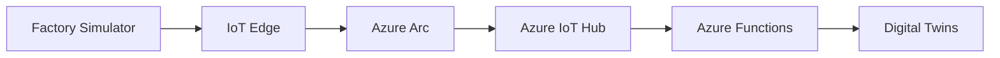

# Azure Local Components

Este directorio contiene todos los componentes que se ejecutan **on-premise** (Azure Local).

## 📁 Estructura

### `factory-simulator/`
- **Device Simulator**: Simulador Node.js de dispositivos industriales
- **Telemetría**: Genera datos de temperatura, presión, OEE, vibración
- **Conexión**: Envía datos a Azure IoT Hub

### `arc-simple-vm/`
- **VM Info**: arc-simple (130.131.248.173)
- **Azure Arc**: Conecta VM on-premise con Azure Cloud
- **Edge Config**: Configuración para IoT Edge Runtime (futuro)

## 🏭 Factory Simulation

La VM `arc-simple` ejecuta:

```powershell
# Factory data simulation
$factoryData = @{
    'Temperature' = Get-Random -Minimum 18.5 -Maximum 23.2
    'Pressure' = Get-Random -Minimum 101.2 -Maximum 102.8  
    'OEE' = Get-Random -Minimum 75 -Maximum 95
    'Timestamp' = Get-Date -Format "yyyy-MM-ddTHH:mm:ss.fffZ"
}
```

## 🔌 Conectividad Híbrida

### Azure Arc Connection
- **Status**: ✅ Conectado a Azure Cloud
- **Resource Group**: smart-factory-rg  
- **Subscription**: Azure Local subscription

### Datos que se envían al Cloud:
- **Telemetría Industrial**: Sensores IoT simulados
- **Métricas VM**: CPU, memoria, disco
- **Logs Operacionales**: EventLog, aplicaciones

## 🚀 Próximos Pasos

1. **IoT Edge Runtime**: Instalar en arc-simple VM
2. **Edge Modules**: Procesamiento local antes de Cloud
3. **Offline Scenarios**: Buffer local cuando no hay conectividad
4. **Security**: Certificates y secure device provisioning

## 🔗 Conexión con Cloud

