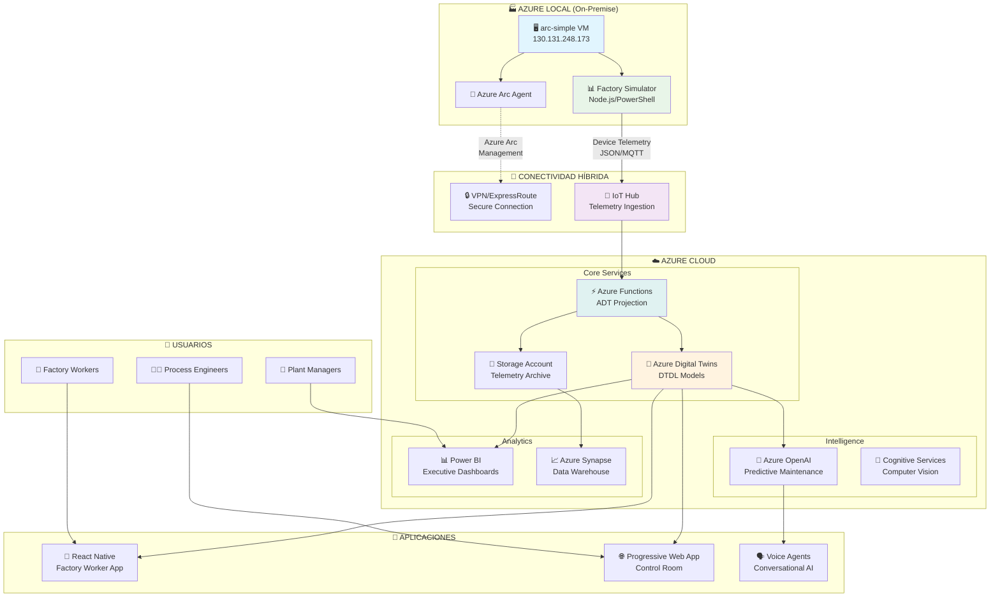

# Arquitectura Híbrida - Smart Factory

## Diagrama de Arquitectura General



## Flujo de Datos End-to-End

### 1. **Data Generation (Azure Local)**
```
Factory Simulator → Sensors Data → Azure Arc → Cloud
```

### 2. **Cloud Processing** 
```
IoT Hub → Azure Functions → Digital Twins → Applications
```

### 3. **User Consumption**
```
Digital Twins → Mobile App → Factory Workers
Digital Twins → Web Dashboard → Engineers  
Digital Twins → Power BI → Management
```

## Componentes por Capa

### **🏭 Azure Local (On-Premise)**
- **arc-simple VM**: Windows Server con Azure Arc
- **Factory Simulator**: Generador de telemetría industrial
- **Local Dashboard**: Control room local (futuro)

### **🌉 Conectividad Híbrida**
- **Azure Arc**: Gestión híbrida VM → Cloud
- **IoT Hub**: Ingesta de telemetría industrial
- **ExpressRoute**: Conectividad dedicada (opcional)

### **☁️ Azure Cloud**
- **Digital Twins**: Modelo digital de la fábrica
- **Azure Functions**: Procesamiento serverless
- **Azure OpenAI**: Inteligencia artificial
- **Power BI**: Analytics y dashboards

### **📱 Aplicaciones**
- **React Native**: App móvil para trabajadores  
- **PWA**: Dashboard web responsive
- **Voice Agents**: Asistentes conversacionales

## Tecnologías Utilizadas

### **Backend Cloud**
- Azure Digital Twins, IoT Hub, Functions
- Azure OpenAI, Cognitive Services
- Power BI, Azure Synapse

### **Frontend Applications** 
- React Native (Mobile)
- React + TypeScript (Web)
- Progressive Web App (PWA)

### **Edge/Local**
- Windows Server + Azure Arc
- PowerShell + Node.js
- Local SQLite storage

### **Infrastructure**
- Bicep Infrastructure as Code
- GitHub Actions CI/CD
- Azure DevOps Pipelines