# Smart Factory - Arquitectura Física con Iconos Azure

## Diagrama Principal - Arquitectura Física

## Métricas de Performance

```mermaid
graph LR
    subgraph "📊 KPIs del Sistema"
        ACC[🎯 ML Accuracy<br/>94.7%]
        DOWN[⬇️ Downtime Reduction<br/>38%]
        ROI[💰 ROI Annual<br/>$2.2M]
        LAT[⚡ Processing Latency<br/>&lt;100ms]
        AVAIL[✅ Availability<br/>99.9%]
        ARCH[🏗️ Well-Architected Score<br/>90/100]
    end
    
    classDef metric fill:#E8F5E8,stroke:#2E7D32,stroke-width:2px,color:#000
    class ACC,DOWN,ROI,LAT,AVAIL,ARCH metric
```

## Arquitectura de Red

```mermaid
graph TB
    subgraph "🌐 Azure Virtual Network (10.0.0.0/16)"
        subgraph "🖥️ VM Subnet"
            VM_NET[10.0.1.0/24<br/>Virtual Machines<br/>Management Layer]
        end
        
        subgraph "📡 IoT Subnet"
            IOT_NET[10.0.2.0/24<br/>IoT Hub & Event Hub<br/>Message Processing]
        end
        
        subgraph "⚡ Functions Subnet"
            FUNC_NET[10.0.3.0/24<br/>Azure Functions<br/>Logic Apps<br/>Compute Layer]
        end
        
        NSG[🔒 Network Security Groups<br/>Traffic Control<br/>Security Rules]
    end
    
    subgraph "🏭 On-Premises Network"
        FACTORY_NET[192.168.1.0/24<br/>Factory Floor<br/>Industrial Network]
    end
    
    VPN[🔐 Site-to-Site VPN<br/>Secure Connection<br/>Hybrid Connectivity]
    
    FACTORY_NET ---|Encrypted Tunnel| VPN
    VPN ---|Gateway| VM_NET
    
    VM_NET ---|Internal| IOT_NET
    IOT_NET ---|Internal| FUNC_NET
    
    NSG -.->|Rules| VM_NET
    NSG -.->|Rules| IOT_NET
    NSG -.->|Rules| FUNC_NET
    
    classDef network fill:#E3F2FD,stroke:#1976D2,stroke-width:2px,color:#000
    classDef security fill:#FFEBEE,stroke:#C62828,stroke-width:2px,color:#000
    classDef onprem fill:#FFF8E1,stroke:#F57C00,stroke-width:2px,color:#000
    
    class VM_NET,IOT_NET,FUNC_NET,VPN network
    class NSG security
    class FACTORY_NET onprem
```

## Flujo de Datos en Tiempo Real

```mermaid
sequenceDiagram
    participant M as 🤖 Máquinas
    participant E as 📦 Edge Gateway
    participant I as 📡 IoT Hub
    participant F as ⚡ Functions
    participant D as 🏭 Digital Twins
    participant A as 🌐 Apps
    
    M->>E: Telemetría (100ms)
    E->>E: Procesamiento Local
    E->>I: Datos Agregados (1s)
    I->>F: Event Trigger
    F->>D: ADT Update
    D->>A: Real-time State
    
    Note over M,A: Latencia total: <500ms
    
    loop Cada 5 minutos
        F->>F: ML Prediction
        F->>A: Maintenance Alert
    end
    
    loop Histórico
        I->>TSI: Time Series Data
        TSI->>STORAGE: Archive
    end
```

## Arquitectura de Seguridad

```mermaid
graph TB
    subgraph "🔒 Security Layers"
        subgraph "🔐 Identity & Access"
            AAD[🔑 Azure AD<br/>Single Sign-On<br/>Role-based Access]
            RBAC[👥 RBAC<br/>Least Privilege<br/>Role Assignment]
        end
        
        subgraph "🛡️ Network Security"
            NSG[🔒 NSG Rules<br/>Traffic Filtering<br/>Port Control]
            FW[🔥 Azure Firewall<br/>Application Rules<br/>Network Rules]
        end
        
        subgraph "🔐 Data Protection"
            KV[🗝️ Key Vault<br/>Secret Management<br/>Certificate Store]
            ENC[🔒 Encryption<br/>Data at Rest<br/>Data in Transit]
        end
        
        subgraph "👁️ Monitoring & Compliance"
            SC[🛡️ Security Center<br/>Threat Detection<br/>Compliance Score]
            SENT[👮 Azure Sentinel<br/>SIEM & SOAR<br/>Threat Intelligence]
        end
    end
    
    AAD --> RBAC
    RBAC -.-> NSG
    NSG --> FW
    FW -.-> KV
    KV --> ENC
    ENC -.-> SC
    SC --> SENT
    
    classDef security fill:#FFEBEE,stroke:#C62828,stroke-width:2px,color:#000
    classDef identity fill:#E8EAF6,stroke:#3F51B5,stroke-width:2px,color:#000
    classDef monitoring fill:#FFF3E0,stroke:#E65100,stroke-width:2px,color:#000
    
    class KV,ENC,NSG,FW security
    class AAD,RBAC identity
    class SC,SENT monitoring
```

## Stage 4: Visión AR/VR

```mermaid
graph TB
    subgraph "🥽 Immersive Experiences"
        subgraph "🏭 Mixed Reality Factory"
            HOLO[🥽 HoloLens 2<br/>Spatial Anchors<br/>Gesture Control]
            MOBILE_AR[📱 Mobile AR<br/>iOS/Android<br/>Marker Tracking]
        end
        
        subgraph "🎓 Training & Simulation"
            VR_TRAIN[🥽 VR Training<br/>Oculus/Vive<br/>Safety Protocols]
            SIM[🎮 3D Simulation<br/>Digital Twin<br/>Scenario Testing]
        end
        
        subgraph "☁️ Cloud Rendering"
            RR[☁️ Remote Rendering<br/>High-fidelity Graphics<br/>Real-time Streaming]
            SA[⚓ Spatial Anchors<br/>Persistent Holograms<br/>Multi-user Sync]
        end
    end
    
    subgraph "🔗 Integration Layer"
        DT_3D[🏭 Digital Twin 3D<br/>Real-time Geometry<br/>Physics Simulation]
        ML_AR[🤖 ML for AR<br/>Object Recognition<br/>Predictive Overlays]
    end
    
    HOLO --> SA
    MOBILE_AR --> SA
    VR_TRAIN --> RR
    SIM --> RR
    
    SA -.-> DT_3D
    RR -.-> DT_3D
    DT_3D --> ML_AR
    
    ML_AR -.->|Predictions| HOLO
    ML_AR -.->|Alerts| MOBILE_AR
    
    classDef ar fill:#E1F5FE,stroke:#0277BD,stroke-width:2px,color:#000
    classDef vr fill:#F3E5F5,stroke:#7B1FA2,stroke-width:2px,color:#000
    classDef cloud fill:#E8F5E8,stroke:#2E7D32,stroke-width:2px,color:#000
    classDef ai fill:#FFF3E0,stroke:#E65100,stroke-width:2px,color:#000
    
    class HOLO,MOBILE_AR ar
    class VR_TRAIN,SIM vr
    class RR,SA cloud
    class DT_3D,ML_AR ai
```

## Resumen de Arquitectura

### 🎯 Componentes Clave:
- **Edge Layer**: Azure Stack Edge + IoT Edge Runtime
- **Connectivity**: VNet 10.0.0.0/16 con 3 subnets especializadas
- **Azure Services**: IoT Hub, Digital Twins, Functions, ML Workspace
- **Applications**: 3D Viewer, Mobile Server, Dashboard
- **Future Vision**: HoloLens 2, Remote Rendering, VR Training

### 📊 Performance:
- **Latencia**: <100ms edge-to-cloud
- **Disponibilidad**: 99.9%
- **ML Accuracy**: 94.7%
- **ROI**: $2.2M anual

### 🔒 Security:
- Azure AD + RBAC
- Network Security Groups
- Key Vault para secretos
- Encryption end-to-end

### 🌐 Network:
- Site-to-Site VPN
- Subnets segmentadas
- NSG rules configuradas
- Hybrid connectivity