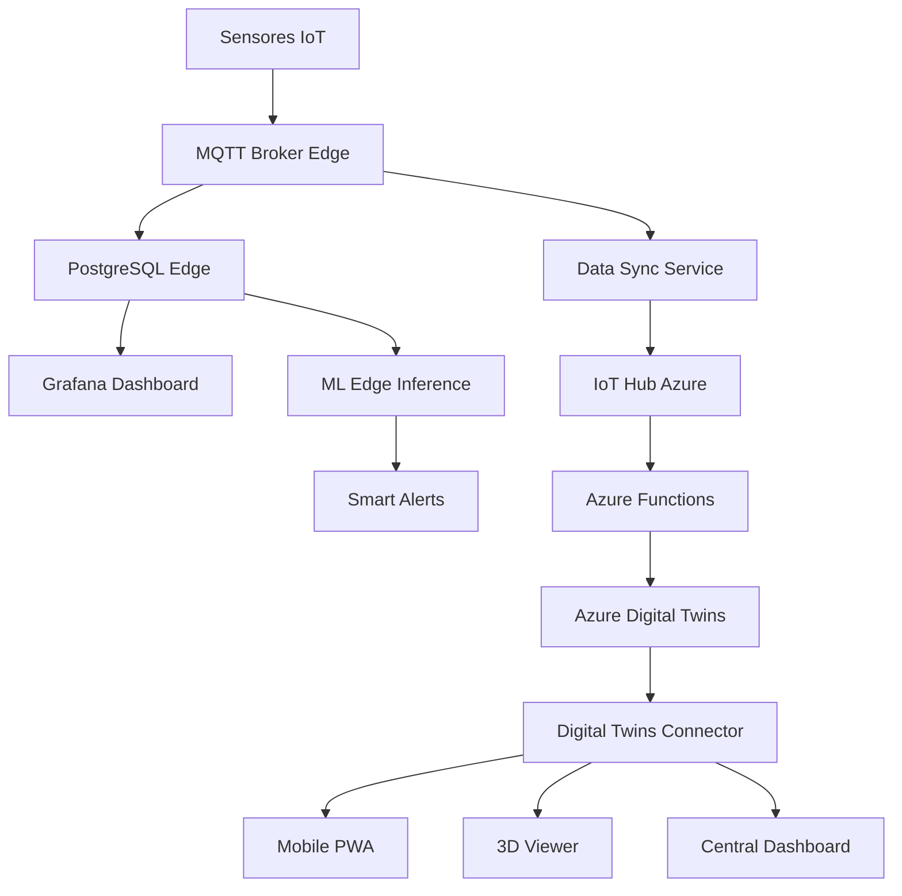

# Smart Factory - Arquitectura Integrada Completa

## 🎯 Ecosistema COMPLETO

### **🏭 Edge Layer (Autónomo)**
```yaml
AKS Cluster:
├── PostgreSQL + TimescaleDB ✅ (Puerto 5432)
├── Grafana Dashboard ✅ (Puerto 30000) 
├── MQTT Broker (Eclipse Mosquitto) → SIGUIENTE
└── Factory API (Conectividad local)
```

### **📱 Aplicaciones Layer**
```yaml
PWA/Portales:
├── Mobile App (PWA) → localhost:3002 ✅
├── 3D Digital Twins Viewer → localhost:3003 ✅
├── Central Dashboard → localhost:8080 ✅
└── Digital Twins Connector → localhost:3001 ✅
```

### **☁️ Cloud Layer (Azure)**
```yaml
Digital Twins Stack:
├── Azure Digital Twins ✅
├── IoT Hub ✅
├── Azure Functions (ADT Projection) ✅
├── Device Simulator ✅
└── DTDL Models (Factory/Line/Machine/Sensor) ✅
```

## 🔄 Data Flow Integrado

### **Flujo Principal:**


## 🎯 Plan de UNIFICACIÓN

### **Paso 1: Completar Edge Stack** 
- ✅ PostgreSQL funcionando
- 🔄 MQTT Broker → AHORA
- ⏳ Data Sync Service
- ⏳ ML Inference Edge

### **Paso 2: Conectar PWAs**
- ✅ Mobile App existente
- 🔄 Conectar a PostgreSQL Edge
- 🔄 Integrar con Grafana
- 🔄 Real-time updates

### **Paso 3: Unificar Dashboards**
- ✅ Grafana para métricas
- ✅ 3D Viewer para visualización
- ✅ Mobile para field workers
- 🔄 Central Dashboard orchestration

## 🚀 Beneficios de la Arquitectura

1. **Autonomía Total**: Factory funciona sin internet
2. **Dashboards Múltiples**: Diferentes usuarios, diferentes vistas
3. **Sync Selectivo**: Solo datos valiosos al cloud
4. **ML Híbrido**: Inference local + Training cloud
5. **PWA Mobile**: Acceso offline para técnicos

## 📊 Estado Actual vs Objetivo

| Componente | Estado | Integración |
|------------|---------|-------------|
| PostgreSQL | ✅ Running | Edge completo |
| Grafana | ✅ Deployed | Needs data source |
| MQTT Broker | ⏳ Pending | Core connectivity |
| Mobile PWA | ✅ Exists | Needs edge connection |
| Digital Twins | ✅ Azure | Cloud sync ready |
| ML Models | ⏳ Pending | Edge + Cloud training |

## 🎯 PRÓXIMO PASO: MQTT + Data Integration