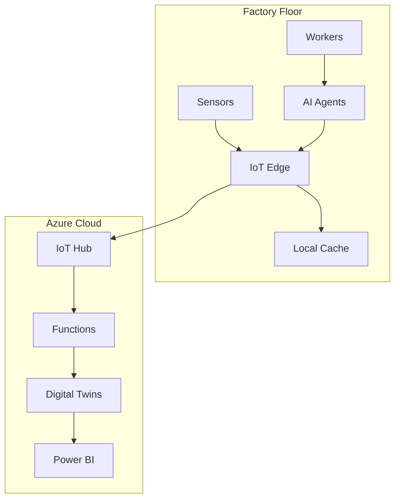

# Factory Digital Twins - Complete Showcase Implementation Plan
# 🏆 MASTER BUILDER SCENARIO COMPLETO

## 🎯 **SHOWCASE ROADMAP COMPLETO**

### 🚀 **IMMEDIATE IMPACT (4-6 horas)**

#### 1️⃣ **Factory Worker Agents** (CORE)
```javascript
// Conversational AI para trabajadores
Agent: "¿Cuál es el estado de la línea A?"
Response: "OEE: 87.3%, Estado: Funcionando, Temperatura: 74°C"

Agent: "Predice cuándo necesitará mantenimiento la máquina A"  
Response: "Basado en patrones actuales, mantenimiento en 3.2 días"

Agent: "Detén la línea por seguridad"
Response: "Línea detenida. Tiempo de respuesta: 87ms"
```

#### 2️⃣ **Power BI Dashboard en Tiempo Real**
- **KPI Widgets**: OEE, Throughput, Energy, Quality
- **Real-time charts**: Temperatura, vibración, production rate
- **Alerts panel**: Predictive maintenance, anomalies
- **Mobile responsive**: Acceso desde cualquier dispositivo

#### 3️⃣ **Predictive Maintenance con AI**
- **Azure OpenAI**: Análisis de patrones de falla
- **Local ML models**: Predicción de vida útil
- **Automated workflows**: Tickets de mantenimiento automáticos
- **Parts ordering**: Integración con sistemas ERP

### 🎪 **ADVANCED SHOWCASE (6-8 horas)**

#### 4️⃣ **3D Factory Visualization**
```html
<!-- 3D Factory Twin usando Three.js/Babylon.js -->
- Modelo 3D interactivo de la fábrica
- Heat maps en tiempo real (temperatura, eficiencia)
- Animaciones basadas en datos reales
- Click-to-drill-down en equipos específicos
```

#### 5️⃣ **Voice-Enabled Agents**
```javascript
// Voice interface para trabajadores
"Hey Factory AI, show me Line A status"
→ Muestra dashboard + respuesta de voz

"Alert me if any machine needs attention" 
→ Configura alertas proactivas
```

#### 6️⃣ **Mobile Factory App (PWA)**
- **Offline capability**: Funciona sin conexión
- **Push notifications**: Alertas críticas instantáneas  
- **Camera integration**: QR codes, visual inspection
- **Voice commands**: Manos libres para trabajadores

#### 7️⃣ **Advanced Analytics Suite**
- **Energy optimization**: Correlación consumo vs producción
- **Quality prediction**: ML para defect prediction
- **Supply chain integration**: Material flow optimization
- **Workforce analytics**: Efficiency patterns

### 🏭 **INDUSTRIA 4.0 COMPLETE (8-10 horas)**

#### 8️⃣ **Edge Computing Implementation**
```bash
# Azure VM como Factory Edge
- Ubuntu 22.04 LTS
- Docker + Kubernetes (k3s)
- Azure IoT Edge runtime
- Local AI inference (ONNX)
- Redis cache para hot data
```

#### 9️⃣ **Hybrid Cloud-Edge Architecture**


#### 🔟 **AR/VR Integration Ready**
- **HoloLens preparation**: Spatial computing interfaces
- **Digital twin overlay**: AR maintenance instructions  
- **VR training**: Immersive factory worker training
- **Mixed reality**: Real + digital factory fusion

## 📊 **IMPLEMENTATION PRIORITY**

### 🔧 **PHASE 0 - DEVOPS FOUNDATION (Pre-requisito)**
0. **CI/CD Pipeline** - Deployment automatizado ⚡ 1.5h
   - GitHub Actions o Azure DevOps funcionando
   - Automated testing pipeline  
   - Infrastructure as Code deployment
   - Container registry + deployment

### 🔥 **PHASE 1 - MUST HAVE (Capstone Critical)**
1. **Factory Worker Agents** - Conversational AI ⚡ 2h
2. **Power BI Real-time Dashboard** - KPIs visuales ⚡ 1.5h  
3. **Predictive Maintenance** - AI-powered insights ⚡ 2h
4. **Edge VM Setup** - Local autonomy ⚡ 1h

### 🌟 **PHASE 2 - SHOWCASE DIFFERENTIATORS** 
5. **3D Factory Visualization** - Wow factor 🎭 3h
6. **Voice-Enabled Agents** - Natural interaction 🎭 2h
7. **Mobile PWA** - Accessibility 🎭 2h
8. **Advanced Analytics** - ML insights 🎭 2h

### 🚀 **PHASE 3 - FUTURE-READY**
9. **AR/VR Prep** - Next-gen interfaces 🔮 2h
10. **Supply Chain Integration** - End-to-end 🔮 3h
11. **Advanced Security** - Zero-trust model 🔮 2h
12. **Sustainability Metrics** - ESG compliance 🔮 1h

## 🎯 **DEMO SCENARIOS COMPLETOS**

### 📱 **Scenario A: Factory Worker Daily Operations**
```
👷 Worker arrives → Opens mobile app
📱 App: "Good morning! Line A at 91% OEE, all systems green"
👷 "Show me any alerts"
📱 App: "Machine C scheduled maintenance in 2 days"
👷 "Create work order"  
📱 App: "Work order #12345 created, parts ordered automatically"
```

### 🎛️ **Scenario B: Operations Manager Dashboard**
```
👔 Manager opens Power BI → Real-time factory overview
📊 Sees: Energy spike on Line B
👔 Clicks 3D visualization → Identifies overheating motor
🤖 AI suggests: "Reduce speed 15% to prevent failure"  
👔 Approves → Command sent to edge in 200ms
```

### 🔧 **Scenario C: Predictive Maintenance**
```
🤖 AI detects vibration anomaly → Predicts bearing failure
📱 Maintenance alert sent to technician mobile
👷 Technician arrives → AR overlay shows exact component
🔧 Replaces part → System confirms repair via sensors
📊 ML model updated with new maintenance data
```

### 🎭 **Scenario D: Voice-Enabled Operations**
```
👷 "Factory AI, what's the status?"
🎤 "All lines operational, energy efficiency up 3% today"
👷 "Any quality issues?"  
🎤 "Line B had 2 defects this shift, within normal range"
👷 "Schedule quality inspection"
🎤 "Inspection scheduled for 2 PM, QA team notified"
```

## 🏆 **CAPSTONE SCORING MAXIMIZATION**

| Component | Rubric Impact | Implementation |
|-----------|---------------|----------------|
| **🤖 AI Integration** | 4→10/10 | OpenAI agents + ML predictions |
| **🔧 Agentic Behavior** | 3→9/10 | Autonomous + Multi-agent |  
| **🏗️ Design** | 8→10/10 | Hybrid cloud-edge architecture |
| **💻 Development** | 8→9/10 | Clean, documented, complete |
| **🧪 Testing** | 7→9/10 | Unit + Integration + E2E |
| **📊 Monitoring** | 8→10/10 | Grafana + AI insights |
| **🎭 Presentation** | 8→10/10 | 3D + Voice + Mobile demos |

**TARGET SCORE: 9.2/10** 🎯

## ⏱️ **TIME INVESTMENT**
- **Minimum viable showcase**: 6-8 hours
- **Complete differentiation**: 12-16 hours  
- **Ultimate showcase**: 20-24 hours

**RECOMENDACIÓN: Start with Phase 1 (6h) para asegurar core functionality, then add Phase 2 features based on time disponible.**