# Arquitectura de IA del Smart Factory Copilot

```mermaid
flowchart TD
    %% User Interface
    User[👤 Usuario] --> UI[🖥️ Copilot Dashboard]
    
    %% Natural Language Processing
    UI --> NLP[🧠 Análisis NLP]
    NLP --> Intent[🎯 Detección de Intent]
    
    %% Intent Classification
    Intent --> Production[📊 production_status]
    Intent --> Maintenance[🔧 maintenance]
    Intent --> Energy[⚡ energy_optimization]
    Intent --> Quality[✨ quality_metrics]
    Intent --> Predictive[🔮 predictive_analysis]
    Intent --> Alerts[🚨 alerts]
    Intent --> Performance[📈 performance]
    Intent --> Diagnostics[🩺 diagnostics]
    
    %% Azure Digital Twins Data Sources
    subgraph Azure[☁️ Azure Cloud]
        direction TB
        ADT[🏭 Azure Digital Twins]
        Factory[🏗️ Factory Twin]
        Line1[📍 LINE-1 Twin]
        Line2[📍 LINE-2 Twin] 
        Line3[📍 LINE-3 Twin]
        Machine1[⚙️ CNC-01 Twin]
        Machine2[🤖 ROBOT-01 Twin]
        Machine3[🔄 CONV-01 Twin]
        
        Factory --> Line1
        Factory --> Line2
        Factory --> Line3
        Line1 --> Machine1
        Line1 --> Machine2
        Line1 --> Machine3
    end
    
    %% AI Processing Engine
    subgraph AIEngine[🤖 AI Processing Engine]
        direction TB
        DataRetrieval[📥 Data Retrieval]
        AIAnalysis[🧠 AI Analysis]
        ContextBuilder[🔧 Context Builder]
        ResponseGenerator[📝 Response Generator]
        
        DataRetrieval --> AIAnalysis
        AIAnalysis --> ContextBuilder
        ContextBuilder --> ResponseGenerator
    end
    
    %% Intent Processing Routes
    Production --> DataRetrieval
    Maintenance --> DataRetrieval
    Energy --> DataRetrieval
    Quality --> DataRetrieval
    Predictive --> DataRetrieval
    Alerts --> DataRetrieval
    Performance --> DataRetrieval
    Diagnostics --> DataRetrieval
    
    %% Azure Data Connection
    ADT --> DataRetrieval
    
    %% AI Analysis Components
    subgraph Analytics[📊 AI Analytics]
        direction TB
        ML[🧮 Machine Learning]
        Patterns[📈 Pattern Recognition]
        Anomalies[⚠️ Anomaly Detection]
        Predictions[🔮 Predictive Models]
        
        ML --> Patterns
        Patterns --> Anomalies
        Anomalies --> Predictions
    end
    
    AIAnalysis --> Analytics
    
    %% Real-time Telemetry
    subgraph EdgeData[🌐 Edge Data Sources]
        direction LR
        K3s[⚓ K3s Cluster]
        MQTT[📡 MQTT Broker]
        IoTEdge[📱 IoT Edge]
        Sensors[📊 Sensores Reales]
        
        Sensors --> MQTT
        MQTT --> IoTEdge
        IoTEdge --> K3s
    end
    
    K3s --> ADT
    
    %% Response Generation
    subgraph ResponseTypes[📝 Tipos de Respuesta]
        direction TB
        StatusReport[📊 Reportes de Estado]
        Recommendations[💡 Recomendaciones]
        Actions[⚡ Acciones Automatizadas]
        Insights[🧠 Insights Predictivos]
        Alerts[🚨 Alertas Críticas]
        
        StatusReport --> Confidence[📈 Confidence Score]
        Recommendations --> Confidence
        Actions --> Confidence
        Insights --> Confidence
        Alerts --> Confidence
    end
    
    ResponseGenerator --> ResponseTypes
    
    %% API Layer
    subgraph API[🌐 API Layer]
        direction TB
        CopilotAPI[🤖 /api/copilot/chat]
        StatusAPI[📊 /api/copilot/status]
        InsightsAPI[💡 /api/copilot/insights]
        ActionAPI[⚡ /api/copilot/action]
        
        CopilotAPI --> AzureFunctions[⚙️ Azure Functions]
        StatusAPI --> AzureFunctions
        InsightsAPI --> AzureFunctions
        ActionAPI --> AzureFunctions
    end
    
    ResponseTypes --> API
    
    %% User Response
    API --> UI
    UI --> ChatInterface[💬 Chat Interface]
    ChatInterface --> User
    
    %% Action Execution
    ActionAPI --> ExecutionEngine[⚙️ Execution Engine]
    ExecutionEngine --> ADT
    ExecutionEngine --> Notifications[📢 Notificaciones]
    
    %% Learning Loop
    subgraph Learning[🎓 Continuous Learning]
        direction TB
        Feedback[📝 User Feedback]
        PerformanceMetrics[📊 Performance Metrics]
        ModelUpdates[🔄 Model Updates]
        
        Feedback --> ModelUpdates
        PerformanceMetrics --> ModelUpdates
        ModelUpdates --> AIAnalysis
    end
    
    User --> Learning
    ResponseTypes --> Learning
    
    %% Styling
    classDef userClass fill:#e1f5fe,stroke:#01579b,stroke-width:2px
    classDef aiClass fill:#f3e5f5,stroke:#4a148c,stroke-width:2px
    classDef azureClass fill:#e8f5e8,stroke:#2e7d32,stroke-width:2px
    classDef apiClass fill:#fff3e0,stroke:#e65100,stroke-width:2px
    classDef edgeClass fill:#fce4ec,stroke:#880e4f,stroke-width:2px
    
    class User,UI,ChatInterface userClass
    class NLP,Intent,AIEngine,Analytics,Learning aiClass
    class Azure,ADT,Factory,Line1,Line2,Line3,Machine1,Machine2,Machine3 azureClass
    class API,CopilotAPI,StatusAPI,InsightsAPI,ActionAPI,AzureFunctions apiClass
    class EdgeData,K3s,MQTT,IoTEdge,Sensors edgeClass
```



## 🔍 Flujo Detallado del Procesamiento de IA

### 1. **Entrada del Usuario** 💬
- El usuario escribe en lenguaje natural: *"¿Cuál es el estado de producción?"*
- La interfaz captura el mensaje y lo envía al API

### 2. **Análisis de Lenguaje Natural** 🧠
```javascript
// Ejemplo de análisis de intent
analyzeIntent(userMessage) {
    const lowerMessage = userMessage.toLowerCase();
    
    const intents = {
        'production_status': ['production', 'status', 'running', 'operational'],
        'maintenance': ['maintenance', 'repair', 'fix', 'broken'],
        'energy_optimization': ['energy', 'power', 'optimize', 'efficiency']
        // ...más intents
    };
    
    // Detecta el intent basado en palabras clave
    for (const [intent, keywords] of Object.entries(intents)) {
        if (keywords.some(keyword => lowerMessage.includes(keyword))) {
            return intent;
        }
    }
}
```

### 3. **Consulta a Azure Digital Twins** 🏭
```javascript
// Query real de datos de Digital Twins
const query = `
    SELECT * FROM DIGITALTWINS T 
    WHERE IS_OF_MODEL(T, 'dtmi:com:smartfactory:Machine;1')
`;

const twins = [];
const queryIterator = this.dtClient.queryTwins(query);

for await (const item of queryIterator) {
    twins.push(item);
}
```

### 4. **Procesamiento de IA** 🤖
```javascript
async getProductionStatus() {
    let totalMachines = 0;
    let operationalMachines = 0;
    let criticalIssues = [];
    
    for (const twin of this.factoryTwins) {
        if (twin.$metadata.$model.includes('Machine')) {
            totalMachines++;
            
            // Análisis de temperatura crítica
            if (twin.temperature > 80) {
                criticalIssues.push(`${twin.$dtId} temperatura: ${twin.temperature}°C`);
            }
            
            // Análisis de eficiencia
            if (twin.efficiency > 85) {
                operationalMachines++;
            }
        }
    }
    
    // Cálculo de métricas de IA
    const avgOEE = (totalOEE / totalMachines).toFixed(1);
    const confidence = this.calculateConfidence(criticalIssues.length);
    
    return {
        status: this.generateIntelligentResponse(avgOEE, criticalIssues),
        confidence: confidence,
        recommendations: this.generateRecommendations(criticalIssues)
    };
}
```

### 5. **Generación Inteligente de Respuestas** 📝
```javascript
generateIntelligentResponse(avgOEE, criticalIssues) {
    let response = `📊 **Production Status Report:**\n\n`;
    response += `• **Overall OEE:** ${avgOEE}%\n`;
    response += `• **Uptime:** ${uptimePercent}%\n`;
    
    if (criticalIssues.length > 0) {
        response += `\n🚨 **Critical Issues:**\n`;
        criticalIssues.forEach(issue => response += `• ${issue}\n`);
        response += `\nI recommend immediate attention to these temperature alerts.`;
    } else {
        response += `\n✅ All systems operating within normal parameters.`;
    }
    
    return response;
}
```

### 6. **Análisis Predictivo** 🔮
```javascript
async getPredictiveAnalysis() {
    const predictions = [];
    
    for (const twin of this.factoryTwins) {
        // Machine Learning para mantenimiento predictivo
        if (twin.vibration > 0.7 && twin.temperature > 70) {
            predictions.push({
                type: 'Maintenance Required',
                machine: twin.$dtId,
                timeframe: '48-72 hours',
                confidence: 89,
                reason: 'Combined high vibration and temperature indicates bearing wear'
            });
        }
        
        // Predicción de degradación de rendimiento
        if (twin.efficiency < 90 && twin.efficiency > 85) {
            predictions.push({
                type: 'Performance Decline',
                machine: twin.$dtId,
                timeframe: '1-2 weeks',
                confidence: 76,
                reason: 'Gradual efficiency decline pattern detected'
            });
        }
    }
    
    return this.formatPredictions(predictions);
}
```

## 🎯 Características Inteligentes del Copilot

### **Natural Language Understanding** 🧠
- **Procesamiento contextual**: Entiende preguntas complejas
- **Intent classification**: Clasifica automáticamente la intención del usuario
- **Multi-language support**: Soporte para español e inglés

### **Real-time AI Analysis** ⚡
- **Anomaly detection**: Detecta patrones anómalos automáticamente
- **Predictive maintenance**: Predice fallas antes de que ocurran
- **Energy optimization**: Sugiere optimizaciones de energía en tiempo real

### **Intelligent Recommendations** 💡
- **Priority scoring**: Asigna prioridades automáticamente
- **Cost-benefit analysis**: Calcula impacto financiero de recomendaciones
- **Automated actions**: Ejecuta acciones automáticas cuando es seguro

### **Continuous Learning** 📈
- **Feedback loop**: Aprende de las interacciones del usuario
- **Performance tracking**: Monitorea y mejora la precisión
- **Model updates**: Actualiza modelos basado en datos históricos

## 🌟 APIs del Copilot

| Endpoint | Método | Descripción |
|----------|---------|-------------|
| `/api/copilot/chat` | POST | Procesa mensajes de chat con IA |
| `/api/copilot/status` | GET | Estado del agente y métricas |
| `/api/copilot/insights` | GET | Insights generados por IA |
| `/api/copilot/action` | POST | Ejecuta acciones automatizadas |

¡El Copilot utiliza **Azure Digital Twins** como fuente de verdad, **Machine Learning** para análisis predictivo, y **APIs REST** para integración en tiempo real! 🚀