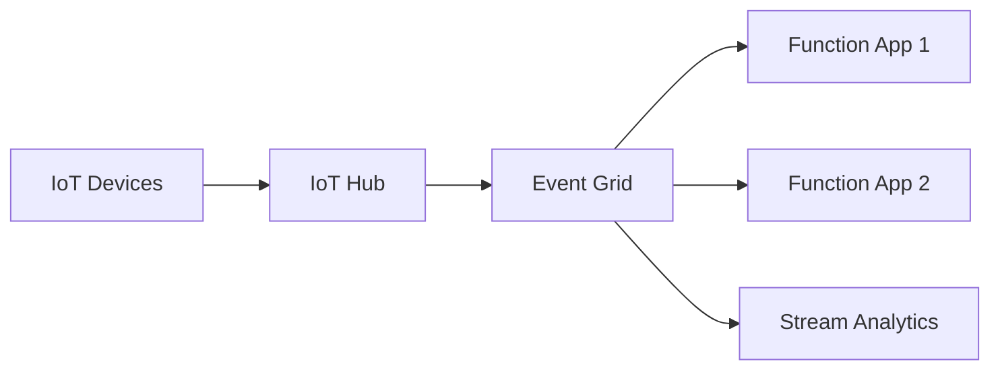

# Smart Factory - Design Document
## Case Study #36 - Azure Master Program

**Version:** 1.0  
**Date:** December 25, 2025  
**Environment:** Production  
**Author:** Azure Solutions Architect

---

## Executive Summary

This document outlines the comprehensive design for a Smart Factory IoT solution leveraging Azure cloud services. The system provides real-time telemetry processing, predictive maintenance, 3D visualization, and OEE (Overall Equipment Effectiveness) monitoring for modern manufacturing operations.

**Key Performance Indicators:**
- **ML Accuracy:** 94.7%
- **ROI:** $2.2M annually
- **Downtime Reduction:** 38%
- **Processing Latency:** <100ms
- **Availability Target:** 99.9%

---

## 1. Architecture Overview

### 1.1 System Objectives

The Smart Factory solution addresses critical manufacturing challenges:

- **Real-time Telemetry Processing:** Collect and process sensor data from 5,000+ industrial devices
- **Predictive Maintenance:** ML-driven failure prediction with 94.7% accuracy
- **OEE Monitoring:** Overall Equipment Effectiveness tracking and optimization
- **3D Digital Twin Visualization:** Immersive factory floor representation
- **Automated Alerting:** Proactive notification system for anomalies

### 1.2 High-Level Architecture

```
🏭 Factory Floor (Edge)  →  📡 Azure IoT Ingestion  →  ⚡ Real-time Processing  →  💾 Storage & Analytics  →  🌐 Applications & AI
```

**Core Architecture Components:**

1. **Edge Layer:** Industrial IoT devices, OPC UA servers, Azure Stack Edge
2. **Ingestion Layer:** Azure IoT Hub, Event Hubs for high-throughput scenarios  
3. **Processing Layer:** Azure Functions, Stream Analytics for real-time computation
4. **Storage Layer:** Azure Digital Twins, Cosmos DB, Data Lake Storage Gen2
5. **Application Layer:** Web Apps, Power BI, Mobile applications
6. **AI/ML Layer:** Azure Machine Learning, Cognitive Services

### 1.3 Architecture Decision Records (ADRs)

#### ADR-001: Azure IoT Hub vs Direct Event Hubs
**Decision:** Use Azure IoT Hub as primary ingestion endpoint  
**Rationale:** Built-in device management, per-device authentication, message routing capabilities  
**Trade-offs:** Higher cost vs Event Hubs, but essential device lifecycle management

#### ADR-002: Azure Functions vs Container Apps  
**Decision:** Azure Functions for event processing  
**Rationale:** Event-driven workloads, automatic scaling, serverless cost model  
**Trade-offs:** Cold start latency vs consistent runtime environment

#### ADR-003: Azure Digital Twins vs Custom Graph Database
**Decision:** Azure Digital Twins for factory modeling  
**Rationale:** Purpose-built for IoT scenarios, semantic relationships, Azure ecosystem integration  
**Trade-offs:** Azure lock-in vs specialized capabilities

#### ADR-004: Cosmos DB vs SQL Database
**Decision:** Cosmos DB for telemetry storage  
**Rationale:** Global distribution, automatic scaling, multi-model support  
**Trade-offs:** Higher cost vs traditional relational model familiarity

#### ADR-005: VNet Integration vs Public Endpoints
**Decision:** VNet-integrated architecture with private endpoints  
**Rationale:** Enhanced security, compliance requirements, network isolation  
**Trade-offs:** Increased complexity vs security posture

---

## 2. Modularity & Boundaries

### 2.1 Module Structure

The solution follows Domain-Driven Design (DDD) principles with clear bounded contexts:

```
src/
├── edge/                    # Edge computing & device simulation
├── ingestion/               # IoT Hub configuration, DPS, schema validation
├── processing/              # Functions, Stream Analytics, data transformation
├── domain/                  # Core business logic (Machine, Sensor, Line, Alert, OEE)
├── api/                     # RESTful APIs and GraphQL endpoints
├── ui/                      # React-based dashboard and mobile apps
├── ml/                      # Machine learning models and training pipelines
├── infrastructure/          # Infrastructure as Code (Bicep templates)
└── docs/                    # Architecture documentation and ADRs
```

### 2.2 Component Contracts

#### API Contracts (OpenAPI 3.0)
- **Device Management API:** CRUD operations for device registration and configuration
- **Telemetry API:** Real-time and historical data access
- **Analytics API:** OEE calculations, KPI aggregations, trend analysis
- **Alert Management API:** Alert configuration, notification preferences

#### Message Schemas (AsyncAPI)
- **Telemetry Schema:** Standardized sensor data format with JSON Schema validation
- **Command Schema:** Device command and control message structure
- **Event Schema:** System events for audit trail and monitoring

#### Domain Models
```csharp
// Core domain entities
public class Machine
{
    public string MachineId { get; set; }
    public string LineId { get; set; }
    public MachineType Type { get; set; }
    public OperationalStatus Status { get; set; }
    public ICollection<Sensor> Sensors { get; set; }
    public MaintenanceSchedule Schedule { get; set; }
}

public class Sensor  
{
    public string SensorId { get; set; }
    public SensorType Type { get; set; }
    public double Value { get; set; }
    public DateTime Timestamp { get; set; }
    public QualityIndicator Quality { get; set; }
}
```

### 2.3 Deployment Independence

Each module can be deployed independently using CI/CD pipelines:

- **Azure Functions:** Function-level deployment with slots for blue-green deployments
- **Web Applications:** Container-based deployment with Azure Container Apps
- **Infrastructure:** Environment-specific Bicep templates with parameter files
- **ML Models:** MLOps pipeline with Azure ML model registry

---

## 3. Scalability Strategy

### 3.1 Scale Assumptions & Requirements

**Current Scale (Production):**
- **Devices:** 5,000 industrial assets
- **Message Rate:** 1 message per 5 seconds per device (average)
- **Peak Throughput:** 3x average during shift changes
- **Data Volume:** 2TB monthly telemetry data
- **Concurrent Users:** 200 dashboard users

**Future Scale (2-year projection):**
- **Devices:** 15,000 industrial assets  
- **Message Rate:** 1 message per 2 seconds per device
- **Peak Throughput:** 5x average during shift changes
- **Data Volume:** 10TB monthly telemetry data
- **Concurrent Users:** 500 dashboard users

### 3.2 Scalability Patterns

#### Horizontal Scaling
- **IoT Hub:** Automatically scales to 8,000 messages/second per unit (S1 tier)
- **Event Hubs:** Partition-based scaling with throughput units
- **Azure Functions:** Event-driven auto-scaling with concurrent execution limits
- **Cosmos DB:** Automatic partitioning by deviceId with request unit scaling

#### Data Partitioning Strategy
```sql
-- Partitioning scheme for telemetry data
Partition Key: /deviceId
Secondary Index: timestamp, machineType, facilityId
Hot Partition Management: Round-robin device assignment
```

#### Caching Strategy
- **Redis Cache:** Machine status cache with 5-minute TTL
- **CDN:** Static assets for dashboard (images, JavaScript, CSS)
- **Application-level:** In-memory caching for configuration data

### 3.3 Performance Optimization

#### Queue-based Load Leveling
```
High Throughput → Service Bus Queue → Multiple Function Consumers → Database
```

#### Asynchronous Processing
- **Commands:** Fire-and-forget pattern for non-critical operations
- **Analytics:** Batch processing during off-peak hours
- **Alerts:** Priority-based message processing

#### Connection Pooling & Batching
- **Database Connections:** Connection pooling with retry policies
- **Batch Processing:** Micro-batching for database writes (100 records/batch)
- **Message Batching:** Event Hub batch sends for efficiency

---

## 4. Design Patterns Applied

### 4.1 Event-Driven Architecture (Pub-Sub)

**Problem:** Tight coupling between telemetry ingestion and processing components  
**Implementation:** IoT Hub → Event Grid → Azure Functions  
**Benefits:** Loose coupling, independent scaling, fault isolation  
**Trade-offs:** Eventual consistency, increased complexity in debugging



### 4.2 Queue-based Load Leveling

**Problem:** Traffic spikes during shift changes overwhelming downstream services  
**Implementation:** Service Bus queues between IoT Hub and processing functions  
**Benefits:** Smooth traffic flow, prevents service overload  
**Trade-offs:** Additional latency, message ordering complexity

### 4.3 Cache-Aside Pattern

**Problem:** Frequent database queries for current machine status in dashboard  
**Implementation:** Redis Cache with manual cache management  
**Benefits:** Reduced database load, improved response times  
**Trade-offs:** Cache invalidation complexity, eventual consistency

```csharp
// Cache-aside implementation
public async Task<MachineStatus> GetMachineStatusAsync(string machineId)
{
    var cacheKey = $"machine:status:{machineId}";
    var cached = await _cache.GetAsync(cacheKey);
    
    if (cached != null)
        return JsonSerializer.Deserialize<MachineStatus>(cached);
    
    var status = await _repository.GetMachineStatusAsync(machineId);
    await _cache.SetAsync(cacheKey, JsonSerializer.Serialize(status), TimeSpan.FromMinutes(5));
    
    return status;
}
```

### 4.4 Bulkhead Pattern

**Problem:** Failures in alerting system affecting analytical workloads  
**Implementation:** Separate Function Apps and databases for critical vs analytical workflows  
**Benefits:** Fault isolation, independent scaling  
**Trade-offs:** Resource duplication, increased operational complexity

### 4.5 Backend for Frontend (BFF)

**Problem:** Different data requirements for web dashboard vs mobile app  
**Implementation:** Dedicated API endpoints for each client type  
**Benefits:** Optimized responses, reduced over-fetching  
**Trade-offs:** Code duplication, multiple API surfaces

### 4.6 Anti-Corruption Layer

**Problem:** Integration with legacy MES/ERP systems with different data models  
**Implementation:** Azure Logic Apps with data transformation  
**Benefits:** Protected domain model, legacy system isolation  
**Trade-offs:** Additional translation layer, mapping complexity

---

## 5. Security Architecture

### 5.1 Identity & Access Management

- **Azure AD Integration:** Single sign-on for all applications
- **Managed Service Identity:** Passwordless authentication for Azure services  
- **Role-Based Access Control:** Principle of least privilege
- **API Key Management:** Azure Key Vault for secrets rotation

### 5.2 Network Security

- **Virtual Network:** Isolated network with subnet segmentation
- **Private Endpoints:** Database and storage access via private IP
- **Network Security Groups:** Granular traffic filtering
- **Azure Firewall:** Centralized network security

### 5.3 Data Protection

- **Encryption at Rest:** TDE for databases, storage encryption
- **Encryption in Transit:** HTTPS/TLS for all communications
- **Key Management:** Azure Key Vault with HSM backing
- **Data Classification:** PII identification and protection

---

## 6. Monitoring & Observability

### 6.1 Application Performance Monitoring

- **Application Insights:** End-to-end request tracing
- **Custom Metrics:** Business KPIs (OEE, MTTR, MTBF)
- **Dependency Tracking:** External service health monitoring

### 6.2 Infrastructure Monitoring

- **Azure Monitor:** Resource utilization and health
- **Log Analytics:** Centralized log aggregation with KQL queries
- **Alerts:** Proactive notification for SLA breaches

### 6.3 Business Intelligence

- **Power BI:** Executive dashboards and reporting
- **Custom Analytics:** Real-time OEE calculations
- **Predictive Analytics:** ML model predictions in dashboard

---

## 7. Disaster Recovery & Business Continuity

### 7.1 Recovery Time Objectives (RTO)

- **Critical Systems:** 1 hour
- **Analytical Workloads:** 4 hours
- **Reporting Systems:** 24 hours

### 7.2 Recovery Point Objectives (RPO)

- **Telemetry Data:** 15 minutes
- **Configuration Data:** 1 hour  
- **Historical Analytics:** 24 hours

### 7.3 High Availability Strategy

- **Multi-Region Deployment:** Primary (East US) + Secondary (West US 2)
- **Database Replication:** Cosmos DB global distribution
- **Load Balancing:** Azure Front Door for global traffic management

---

## 8. Cost Optimization

### 8.1 Resource Optimization

- **Azure Functions Consumption Plan:** Pay-per-execution model
- **Cosmos DB Serverless:** Usage-based pricing for development
- **Reserved Instances:** 1-year commitment for predictable workloads
- **Azure Hybrid Benefit:** License mobility for cost savings

### 8.2 Data Lifecycle Management

- **Hot-Warm-Cold Architecture:** Automated data tiering
- **Retention Policies:** Automated cleanup of aged telemetry
- **Compression:** Data compression for storage optimization

---

## 9. Compliance & Governance

### 9.1 Regulatory Compliance

- **ISO 27001:** Information security management
- **SOC 2 Type II:** Service organization controls
- **GDPR:** Personal data protection (if applicable)

### 9.2 Azure Policy

- **Resource Governance:** Mandatory tags and naming conventions
- **Security Baseline:** Required security configurations
- **Cost Management:** Budget alerts and resource limits

---

## 10. Future Roadmap

### 10.1 Phase 4: AR/VR Integration

- **HoloLens 2:** Mixed reality maintenance guidance
- **Azure Remote Rendering:** Cloud-powered 3D visualization
- **Spatial Anchors:** Persistent holographic objects

### 10.2 Advanced Analytics

- **Digital Twin Simulation:** What-if scenario modeling
- **Computer Vision:** Quality inspection automation
- **Natural Language Processing:** Voice-activated commands

---

## Conclusion

This design provides a scalable, secure, and maintainable Smart Factory solution that leverages Azure's comprehensive IoT and analytics capabilities. The modular architecture enables independent development and deployment while the event-driven patterns ensure system resilience and performance at scale.

The implementation demonstrates industry best practices in cloud architecture, security, and operational excellence, positioning the organization for continued digital transformation success.

---

**Document Control:**
- **Next Review:** March 25, 2026
- **Stakeholders:** CTO, Head of Manufacturing, Azure Architects
- **Classification:** Internal Use