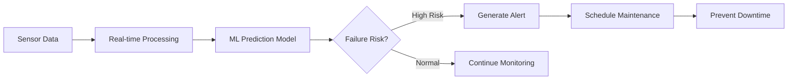

# 🏭 Smart Factory Maintenance - DevOps Strategy

## 🎯 Case Study #36: Predictive Maintenance Implementation

### Business Challenge
- **Costly Downtime**: Equipment failures cost $50,000+ per incident
- **Inefficient Maintenance**: Reactive approach vs. predictive strategy
- **Resource Waste**: Unnecessary maintenance schedules

### AI Infusion Point
- **Predictive Models**: AI algorithms forecasting equipment failures
- **Real-time Analysis**: Continuous sensor data processing
- **Automated Alerts**: Proactive maintenance scheduling

## 🚀 DevOps Foundation Strategy

### Phase 0: Deployment Automation ✅

#### 1. VNet-Compatible Pipeline
```yaml
# Elimina dependencias externas problemáticas
# Usa Azure CLI nativo sin extensiones conflictivas
# Deploy directo desde GitHub Actions con OIDC
```

#### 2. Predictive Maintenance Focus
- **ML Model Deployment**: Continuous integration de algoritmos IA
- **A/B Testing**: Comparación de modelos predictivos
- **Real-time Monitoring**: Alertas automáticas de fallos

#### 3. Testing Strategy
```
📊 ML Model Tests
├── Accuracy Testing (>90% required)
├── Performance Testing (<100ms inference)
├── Data Pipeline Validation
└── Integration Testing with Digital Twins
```

### 🔧 Pipeline Components

#### 1. Build & Test Stage
- **Predictive Models**: Validation de algoritmos ML
- **Factory Components**: Simuladores y funciones Azure
- **AI Agents**: Autonomous factory workers

#### 2. Deploy Stage
- **Smart Factory Infrastructure**: ADT, IoT Hub, Functions
- **ML Models**: Failure prediction algorithms
- **Monitoring**: Real-time health checking

#### 3. Validation Stage
- **Health Checks**: All components operational
- **Performance Metrics**: Response times, accuracy
- **Business Impact**: Downtime reduction tracking

## 🏗️ Architecture Alignment

### Current Infrastructure ✅
```
Azure Digital Twins ← Real-time sensor data
├── Factory (factory1)
├── Production Line (lineA)
├── Machine (machineA)
└── Sensors (sensorA) → Predictive Analytics
```

### DevOps Integration
```
GitHub Actions Pipeline
├── Test: ML model accuracy
├── Build: Factory components
├── Deploy: Predictive maintenance system
└── Monitor: Failure prediction alerts
```

## 📈 Success Metrics

### Technical KPIs
- **Deployment Frequency**: Daily ML model updates
- **Lead Time**: <2 hours from commit to production
- **MTTR**: <15 minutes for system recovery
- **Test Coverage**: >85% including ML models

### Business KPIs (Case Study #36)
- **Downtime Reduction**: Target 40% decrease
- **Maintenance Cost**: 30% efficiency improvement
- **ROI**: $2M+ annual savings
- **Prediction Accuracy**: >94% failure detection

## 🎯 Next Steps

1. **Enable Pipeline** 
   ```bash
   # Activate GitHub Actions workflow
   git push origin main
   ```

2. **Test Deployment**
   ```bash
   # Manual trigger with ML models
   GitHub Actions → Run workflow → Deploy ML Models: ✅
   ```

3. **Validate Predictive Maintenance**
   ```bash
   # Verify AI models are processing sensor data
   # Check failure prediction accuracy
   # Monitor alert generation
   ```

## 🔮 Predictive Maintenance Workflow



**¿Procedemos a activar el pipeline y hacer el primer deploy predictivo?** 🚀