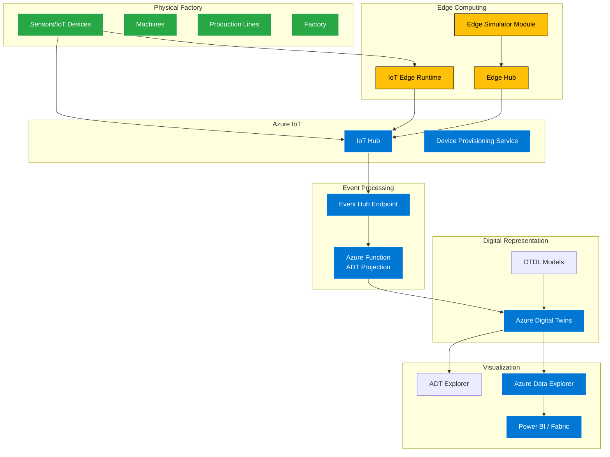

# Factory Digital Twins MVP - Architecture

## Overview

Este proyecto implementa un MVP (Minimum Viable Product) de una línea de fábrica digital usando Azure Digital Twins, IoT Hub y Azure Functions.

## Architecture Diagram



## Components

### 1. **DTDL Models** 
Modelos semánticos que definen la estructura de la fábrica digital:
- `Factory`: Contiene líneas de producción
- `Line`: Línea de producción con métricas OEE y throughput
- `Machine`: Máquina con sensores de temperatura y estado de salud
- `Sensor`: Sensores individuales con telemetría

### 2. **IoT Hub**
- **Ingestion Point**: Recibe telemetría de dispositivos y simuladores
- **Device Management**: Gestiona identidades de dispositivos
- **Routing**: Enruta mensajes a endpoints de procesamiento
- **Store & Forward**: Con IoT Edge para resiliencia offline

### 3. **Azure Function (ADT Projection)**
- **Event-Driven**: Triggered por mensajes de IoT Hub
- **Data Transformation**: Convierte telemetría IoT a updates de Digital Twins  
- **Twin Updates**: Actualiza propiedades de twins
- **Telemetry Publishing**: Publica telemetría en tiempo real

### 4. **Azure Digital Twins**
- **Semantic Modeling**: Representa la fábrica usando modelos DTDL
- **Live Twins**: Instancias digitales de activos físicos
- **Relationships**: Jerarquías factory → line → machine → sensor
- **Query Engine**: Permite consultas sobre el grafo de twins

### 5. **Device Simulator**
- **Realistic Data**: Genera telemetría con variaciones naturales
- **Multiple Scenarios**: Simula operación normal e incidentes
- **Configurable**: Intervalos de envío y parámetros ajustables

### 6. **IoT Edge (Optional)**
- **Edge Computing**: Procesamiento local de datos críticos
- **Store & Forward**: Almacenamiento local durante desconexiones
- **Bandwidth Optimization**: Filtra y agrega datos antes de enviar

## Data Flow

### 1. **Telemetry Ingestion**
```json
{
  "lineId": "lineA",
  "machineId": "machineA", 
  "sensorId": "sensorA",
  "throughput": 120.5,
  "temperature": 78.2,
  "value": 78.2,
  "state": "running", 
  "oee": 0.84,
  "health": "healthy",
  "ts": "2025-12-06T10:30:00.000Z"
}
```

### 2. **Twin Property Updates**
- Line: `oee`, `state`
- Machine: `health`
- Sensor: `kind`, `unit`

### 3. **Telemetry Publishing**
- Line: `throughput` telemetry
- Machine: `temperature` telemetry  
- Sensor: `value` telemetry

## Deployment Architecture

### Development Environment
```
Local Simulator → IoT Hub (Cloud) → Function (Local/Cloud) → ADT (Cloud)
```

### Production Environment  
```
Edge Devices → IoT Edge → IoT Hub → Function App → ADT → Visualization
```

## Security Model

### Authentication
- **Managed Identity**: Function App uses system-assigned identity
- **SAS Keys**: IoT devices use symmetric keys
- **Azure AD**: ADT Explorer uses user authentication

### Authorization
- **RBAC**: Function has "Digital Twins Data Owner" role
- **Device Security**: Individual device credentials
- **Network Security**: HTTPS/TLS encryption throughout

## Scalability Considerations

### Throughput Limits
- **IoT Hub**: S1 tier supports 400,000 messages/day
- **Azure Function**: Consumption plan auto-scales
- **Digital Twins**: 10,000 operations/second per instance

### Optimization Strategies
- **Batching**: Process multiple messages per function execution
- **Caching**: Cache Digital Twins client connections
- **Filtering**: Use IoT Edge to reduce cloud traffic
- **Partitioning**: Use multiple ADT instances for large factories

## Monitoring & Observability

### Key Metrics
- **Message Throughput**: Messages/second through IoT Hub
- **Function Performance**: Execution time and success rate
- **Twin Operations**: Updates/queries per second
- **Data Freshness**: Latency from sensor to twin

### Logging Strategy
- **Structured Logs**: JSON format with correlation IDs
- **Application Insights**: Function App telemetry
- **IoT Hub Monitoring**: Device connectivity and message routing
- **ADT Query Logs**: Performance monitoring for queries

## Cost Optimization

### Resource Sizing
- **IoT Hub**: Start with S1, scale based on message volume
- **Function App**: Consumption plan for variable workloads
- **Digital Twins**: Pay per operation model
- **Storage**: Standard LRS for function storage

### Cost Monitoring
- **Budget Alerts**: Set up cost monitoring
- **Resource Tagging**: Track costs by environment/project
- **Usage Analytics**: Monitor and optimize based on actual usage