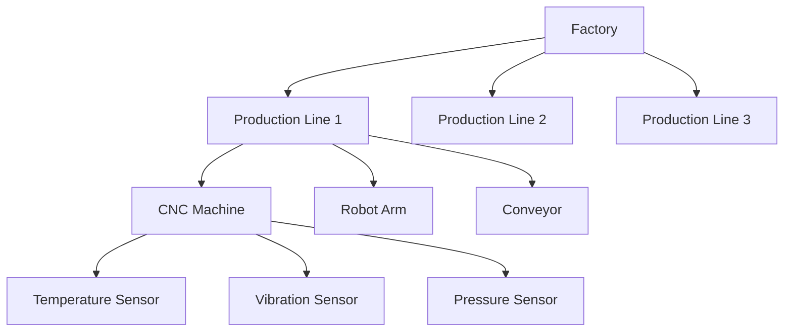
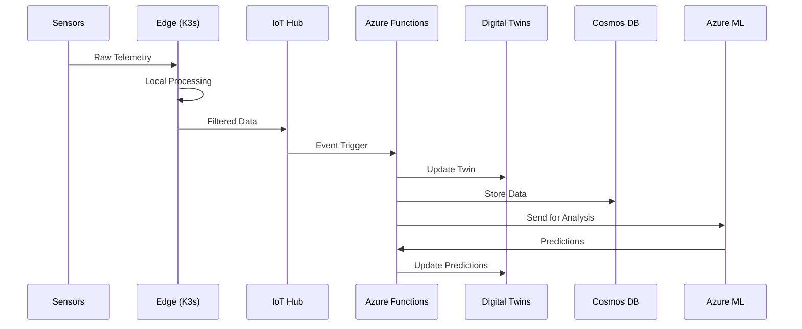
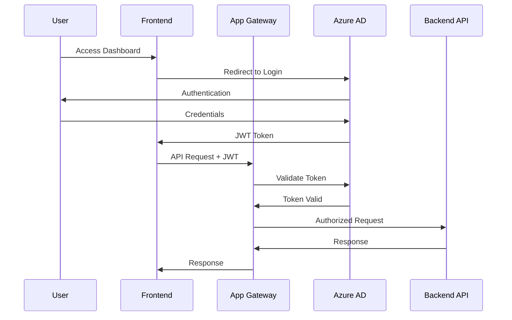

# Smart Factory Implementation Guide

## Quick Start Deployment

### Prerequisites Checklist

```bash
# Required Software
✓ Azure CLI (v2.40+)
✓ Kubectl (v1.24+)
✓ Docker Desktop
✓ Node.js (v18+)
✓ PowerShell 7+

# Azure Subscriptions & Permissions
✓ Azure Subscription with Owner/Contributor role
✓ Azure Digital Twins service available in region
✓ Azure IoT Hub available in region
✓ Resource group creation permissions
```

### 1. Infrastructure Deployment

```powershell
# Clone the repository
git clone https://github.com/artmej/factory-digital-twins-mvp.git
cd factory-digital-twins-mvp

# Set environment variables
$env:RESOURCE_GROUP = "smartfactory-prod-rg"
$env:LOCATION = "eastus"
$env:DEPLOYMENT_NAME = "smartfactory-$(Get-Date -Format 'yyyyMMddHHmm')"

# Create resource group
az group create --name $env:RESOURCE_GROUP --location $env:LOCATION

# Deploy Azure infrastructure
az deployment group create `
  --resource-group $env:RESOURCE_GROUP `
  --template-file ./infra/bicep/main.bicep `
  --parameters `
    location=$env:LOCATION `
    environmentName="prod" `
    factoryName="smartfactory" `
  --name $env:DEPLOYMENT_NAME
```

### 2. Digital Twin Models Setup

```bash
# Get Digital Twins instance endpoint
DT_ENDPOINT=$(az dt list --resource-group $RESOURCE_GROUP --query "[0].hostName" -o tsv)

# Upload digital twin models
az dt model create --dt-name $DT_ENDPOINT --models @models/factory.dtdl.json
az dt model create --dt-name $DT_ENDPOINT --models @models/line.dtdl.json
az dt model create --dt-name $DT_ENDPOINT --models @models/machine.dtdl.json
az dt model create --dt-name $DT_ENDPOINT --models @models/sensor.dtdl.json

# Create digital twin instances
az dt twin create --dt-name $DT_ENDPOINT --dtmi "dtmi:com:factory:Factory;1" --twin-id "FactoryFloor"
az dt twin create --dt-name $DT_ENDPOINT --dtmi "dtmi:com:factory:ProductionLine;1" --twin-id "LINE-1"
az dt twin create --dt-name $DT_ENDPOINT --dtmi "dtmi:com:factory:ProductionLine;1" --twin-id "LINE-2"
az dt twin create --dt-name $DT_ENDPOINT --dtmi "dtmi:com:factory:ProductionLine;1" --twin-id "LINE-3"
```

### 3. Edge Computing Setup (K3s)

```bash
# Install K3s on edge device
curl -sfL https://get.k3s.io | sh -

# Deploy edge applications
kubectl apply -f edge/mqtt-broker.yaml
kubectl apply -f edge/postgresql.yaml
kubectl apply -f edge/grafana.yaml

# Connect to Azure Arc
az extension add --name connectedk8s
az connectedk8s connect --resource-group $RESOURCE_GROUP --name smartfactory-edge
```

### 4. Function App Deployment

```bash
# Navigate to function directory
cd src/function-adt-projection

# Install dependencies
npm install

# Deploy to Azure Functions
func azure functionapp publish smartfactory-functions-prod
```

### 5. Dashboard Deployment

```bash
# Deploy to GitHub Pages (automatic via Actions)
git push origin main

# Or deploy to Azure Static Web Apps
az staticwebapp create \
  --name smartfactory-dashboard \
  --resource-group $RESOURCE_GROUP \
  --source https://github.com/artmej/factory-digital-twins-mvp \
  --branch main \
  --app-location "/docs" \
  --output-location "/docs"
```

## Architecture Deep Dive

### Digital Twin Model Hierarchy



### Data Flow Architecture



### API Endpoints Reference

#### Smart Factory Copilot API

```javascript
// Base URL: https://smartfactory-functions-prod.azurewebsites.net/api

// Chat with AI Copilot
POST /chat
{
  "message": "When is next maintenance on LINE-2?",
  "language": "en" | "es",
  "userId": "user123"
}

// Get factory status
GET /status
Response: {
  "factory": {
    "overall_efficiency": 87.5,
    "active_lines": 3,
    "maintenance_alerts": 2
  },
  "lines": [...],
  "timestamp": "2024-01-08T10:30:00Z"
}

// Get insights and analytics
GET /insights?line=LINE-1&timeRange=24h
Response: {
  "oee": 92.3,
  "availability": 98.1,
  "performance": 94.7,
  "quality": 99.5,
  "predictions": {...}
}

// Execute actions
POST /action
{
  "type": "schedule_maintenance",
  "target": "LINE-2",
  "parameters": {...}
}
```

#### Digital Twins Query Examples

```sql
-- Get all production lines with efficiency > 90%
SELECT T.$dtId, T.efficiency 
FROM DIGITALTWINS T 
WHERE IS_OF_MODEL(T, 'dtmi:com:factory:ProductionLine;1') 
  AND T.efficiency > 90

-- Find machines due for maintenance
SELECT M.$dtId, M.lastMaintenanceDate, M.nextMaintenanceDate 
FROM DIGITALTWINS M 
WHERE IS_OF_MODEL(M, 'dtmi:com:factory:Machine;1') 
  AND M.nextMaintenanceDate <= '2024-01-15T00:00:00Z'

-- Get sensor readings for specific machine
SELECT S.$dtId, S.temperature, S.vibration, S.timestamp 
FROM DIGITALTWINS F 
JOIN DIGITALTWINS L RELATED F.contains 
JOIN DIGITALTWINS M RELATED L.contains 
JOIN DIGITALTWINS S RELATED M.contains 
WHERE F.$dtId = 'FactoryFloor' 
  AND L.$dtId = 'LINE-1' 
  AND IS_OF_MODEL(S, 'dtmi:com:factory:Sensor;1')
```

## Development Guidelines

### Code Structure

```
src/
├── function-adt-projection/     # Azure Functions backend
│   ├── chat/                    # AI Copilot endpoint
│   ├── status/                  # Factory status endpoint
│   ├── insights/                # Analytics endpoint
│   ├── action/                  # Action execution endpoint
│   └── shared/                  # Shared utilities
├── device-simulator/            # IoT device simulator
└── dashboard-apps/              # Frontend applications
    ├── 3d-dashboard/           # 3D visualization
    ├── executive-dashboard/     # ROI analytics
    ├── maintenance-dashboard/   # Predictive maintenance
    └── mobile-app/             # PWA for technicians
```

### Configuration Management

```javascript
// Environment variables
const config = {
  // Azure services
  digitalTwinsUrl: process.env.AZURE_DIGITAL_TWINS_URL,
  cosmosDbEndpoint: process.env.COSMOS_DB_ENDPOINT,
  iotHubConnectionString: process.env.IOT_HUB_CONNECTION_STRING,
  
  // AI services
  openAiEndpoint: process.env.AZURE_OPENAI_ENDPOINT,
  openAiKey: process.env.AZURE_OPENAI_KEY,
  cognitiveServicesKey: process.env.COGNITIVE_SERVICES_KEY,
  
  // Application settings
  defaultLanguage: process.env.DEFAULT_LANGUAGE || 'en',
  maintenanceThreshold: process.env.MAINTENANCE_THRESHOLD || 72, // hours
  alertThreshold: process.env.ALERT_THRESHOLD || 85 // percentage
};
```

### Error Handling Patterns

```javascript
// Standardized error handling
class SmartFactoryError extends Error {
  constructor(message, code, details = null) {
    super(message);
    this.name = 'SmartFactoryError';
    this.code = code;
    this.details = details;
    this.timestamp = new Date().toISOString();
  }
}

// API response wrapper
function createResponse(statusCode, data, error = null) {
  return {
    statusCode,
    headers: {
      'Content-Type': 'application/json',
      'Access-Control-Allow-Origin': '*'
    },
    body: JSON.stringify({
      success: statusCode < 400,
      data: data || null,
      error: error || null,
      timestamp: new Date().toISOString()
    })
  };
}

// Usage example
try {
  const result = await processFactoryData(request);
  return createResponse(200, result);
} catch (error) {
  if (error instanceof SmartFactoryError) {
    return createResponse(400, null, error);
  }
  return createResponse(500, null, {
    message: 'Internal server error',
    code: 'INTERNAL_ERROR'
  });
}
```

## Testing Strategy

### Unit Tests

```javascript
// Function testing with Jest
const { processMaintenanceQuery } = require('../src/chat/maintenanceHandler');

describe('Maintenance Query Processing', () => {
  test('should detect maintenance questions', () => {
    const queries = [
      "When is next maintenance on LINE-2?",
      "¿Cuándo es el próximo mantenimiento en LÍNEA-2?"
    ];
    
    queries.forEach(query => {
      const result = processMaintenanceQuery(query);
      expect(result.intent).toBe('maintenance_schedule');
      expect(result.line).toBe('LINE-2');
    });
  });
});
```

### Integration Tests

```bash
# API endpoint testing
npm test -- --testMatch="**/*.integration.test.js"

# Digital Twins integration
az dt twin query --dt-name $DT_ENDPOINT --query-command "SELECT * FROM DIGITALTWINS"
```

### Performance Tests

```javascript
// Load testing with Artillery
module.exports = {
  config: {
    target: 'https://smartfactory-functions-prod.azurewebsites.net',
    phases: [
      { duration: '2m', arrivalRate: 10 },
      { duration: '5m', arrivalRate: 50 },
      { duration: '2m', arrivalRate: 100 }
    ]
  },
  scenarios: [
    {
      name: 'Chat API Load Test',
      flow: [
        {
          post: {
            url: '/api/chat',
            json: { message: 'What is the status of LINE-1?' }
          }
        }
      ]
    }
  ]
};
```

## Security Implementation

### Authentication Flow



### Secret Management

```bash
# Store secrets in Azure Key Vault
az keyvault secret set --vault-name smartfactory-kv --name "OpenAI-Key" --value "$OPENAI_KEY"
az keyvault secret set --vault-name smartfactory-kv --name "CosmosDB-Key" --value "$COSMOSDB_KEY"

# Grant function app access to Key Vault
az keyvault set-policy \
  --name smartfactory-kv \
  --object-id $(az functionapp identity show --name smartfactory-functions-prod --resource-group $RESOURCE_GROUP --query principalId -o tsv) \
  --secret-permissions get list
```

## Monitoring & Observability

### Application Insights Setup

```javascript
const appInsights = require('applicationinsights');
appInsights.setup(process.env.APPLICATIONINSIGHTS_CONNECTION_STRING)
  .setAutoCollectRequests(true)
  .setAutoCollectPerformance(true)
  .setAutoCollectExceptions(true)
  .setAutoCollectDependencies(true)
  .start();

// Custom telemetry
appInsights.defaultClient.trackEvent({
  name: 'MaintenanceScheduled',
  properties: {
    line: 'LINE-2',
    scheduledDate: '2024-01-15T02:00:00Z',
    reason: 'Predictive maintenance alert'
  }
});
```

### Health Checks

```javascript
// Health check endpoint
module.exports = async function (context, req) {
  const health = {
    status: 'healthy',
    timestamp: new Date().toISOString(),
    services: {
      digitalTwins: await checkDigitalTwins(),
      cosmosDb: await checkCosmosDb(),
      iotHub: await checkIoTHub()
    }
  };
  
  const allHealthy = Object.values(health.services).every(s => s.status === 'healthy');
  health.status = allHealthy ? 'healthy' : 'degraded';
  
  return createResponse(allHealthy ? 200 : 503, health);
};
```

### Alerting Rules

```json
{
  "alertRules": [
    {
      "name": "High Error Rate",
      "condition": "exceptions/count > 10 over 5 minutes",
      "action": "Send email to operations team"
    },
    {
      "name": "Response Time Degradation",
      "condition": "requests/duration > 5000ms over 10 minutes",
      "action": "Scale up function app"
    },
    {
      "name": "Digital Twins Connectivity",
      "condition": "dependencies/failed > 5 over 5 minutes",
      "action": "Alert architecture team"
    }
  ]
}
```

## Performance Optimization

### Caching Strategy

```javascript
// Redis caching for frequent queries
const Redis = require('ioredis');
const redis = new Redis(process.env.REDIS_CONNECTION_STRING);

async function getFactoryStatus() {
  const cacheKey = 'factory:status:current';
  let status = await redis.get(cacheKey);
  
  if (!status) {
    status = await fetchStatusFromDigitalTwins();
    await redis.setex(cacheKey, 60, JSON.stringify(status)); // 1 minute cache
  } else {
    status = JSON.parse(status);
  }
  
  return status;
}
```

### Database Optimization

```javascript
// Cosmos DB query optimization
const querySpec = {
  query: 'SELECT * FROM c WHERE c.line = @lineId AND c._ts > @timestamp',
  parameters: [
    { name: '@lineId', value: 'LINE-1' },
    { name: '@timestamp', value: Date.now() - 86400000 } // 24 hours ago
  ]
};

// Use continuation token for pagination
const options = { 
  maxItemCount: 100,
  enableCrossPartitionQuery: true
};
```

## Troubleshooting Guide

### Common Issues

| Issue | Symptoms | Solution |
|-------|----------|----------|
| Digital Twins Connection Failed | 401/403 errors in logs | Check managed identity permissions |
| IoT Hub Message Loss | Missing telemetry data | Verify device connection strings |
| Function App Cold Start | Slow first requests | Enable always-on or use premium plan |
| Dashboard 404 Errors | Cannot access dashboards | Check GitHub Pages deployment status |

### Debug Commands

```bash
# Check Digital Twins connectivity
az dt twin show --dt-name $DT_ENDPOINT --twin-id "FactoryFloor"

# Verify IoT Hub messages
az iot hub monitor-events --hub-name $IOT_HUB_NAME --timeout 30

# Function logs
az functionapp logs tail --name smartfactory-functions-prod --resource-group $RESOURCE_GROUP

# Kubernetes edge status
kubectl get pods -n smartfactory
kubectl logs -n smartfactory deployment/mqtt-broker
```

---

**This implementation guide provides the complete technical foundation for deploying and maintaining the Smart Factory Digital Twins solution in production environments.**