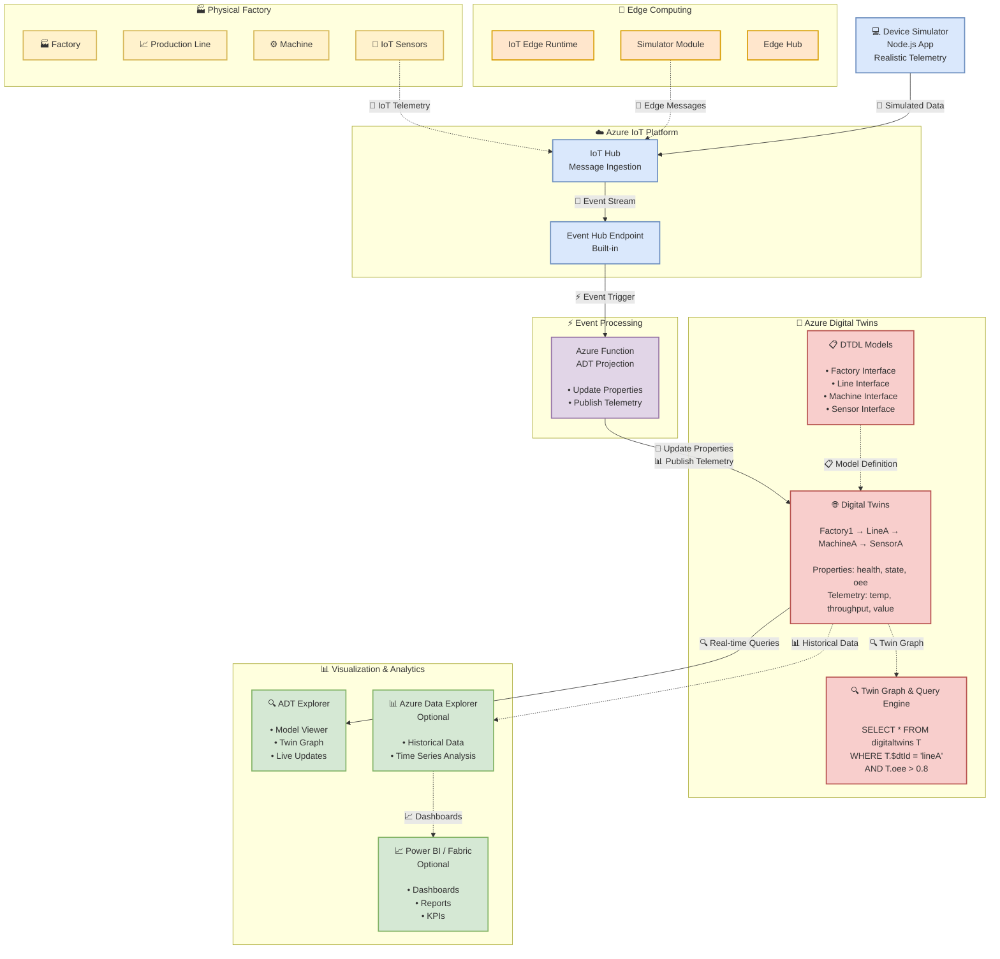
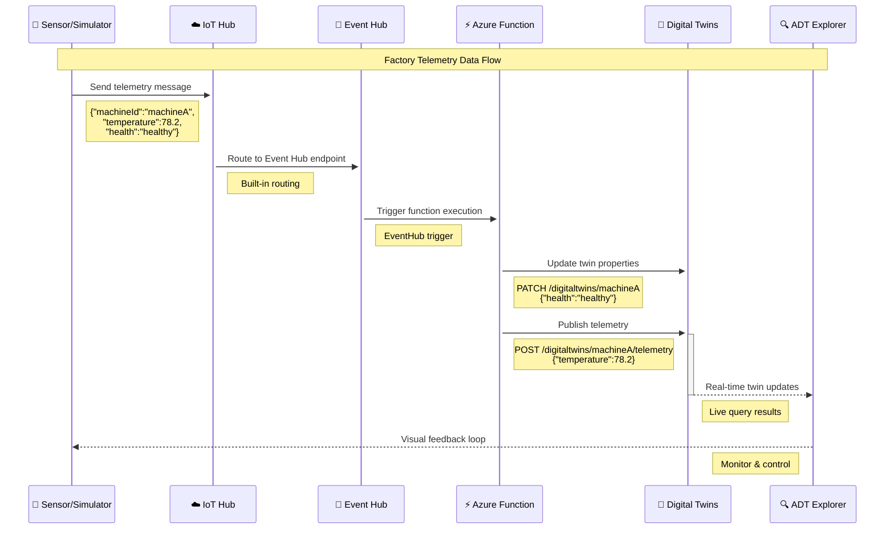
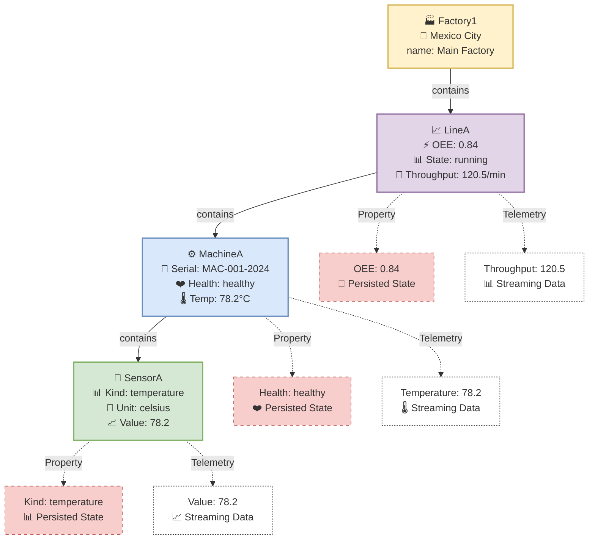
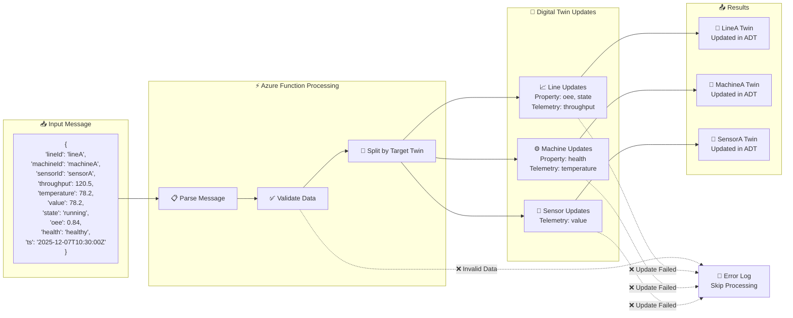
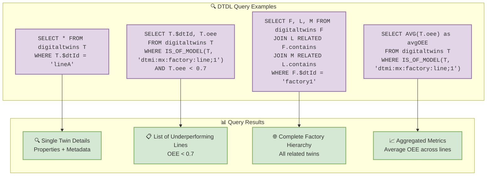
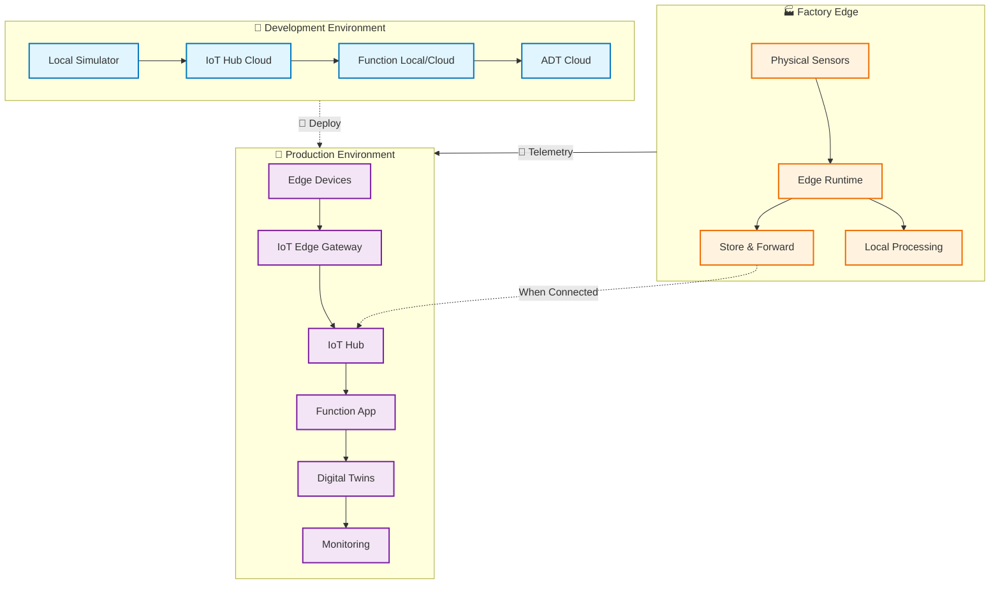

# Factory Digital Twins - Mermaid Diagrams

Diagramas en formato Mermaid que se renderizan automáticamente en GitHub, GitLab, VS Code y muchas plataformas.

## 🏗️ Arquitectura General

## 📊 Data Flow Diagram

## 🌐 Digital Twin Graph Structure

## 🔄 Event Processing Flow

## 🎯 Query Examples

## 🔧 Deployment Architecture

---

## 📝 Cómo Usar estos Diagramas

### **1. En GitHub/GitLab**
Los diagramas se renderizan automáticamente al abrir este archivo.

### **2. En VS Code**
Instala la extensión "Markdown Preview Mermaid Support" para ver los diagramas.

### **3. En Documentación Web**
Muchas plataformas como Notion, GitBook, etc. soportan Mermaid nativamente.

### **4. Exportar como Imagen**
Usa herramientas como:
- https://mermaid.live (online)
- mermaid-cli (command line)
- VS Code extensions

### **5. Personalizar**
Modifica el código Mermaid directamente en este archivo para adaptarlo a tus necesidades.

**¡Los diagramas están listos para usar y personalizar! 📊✨**