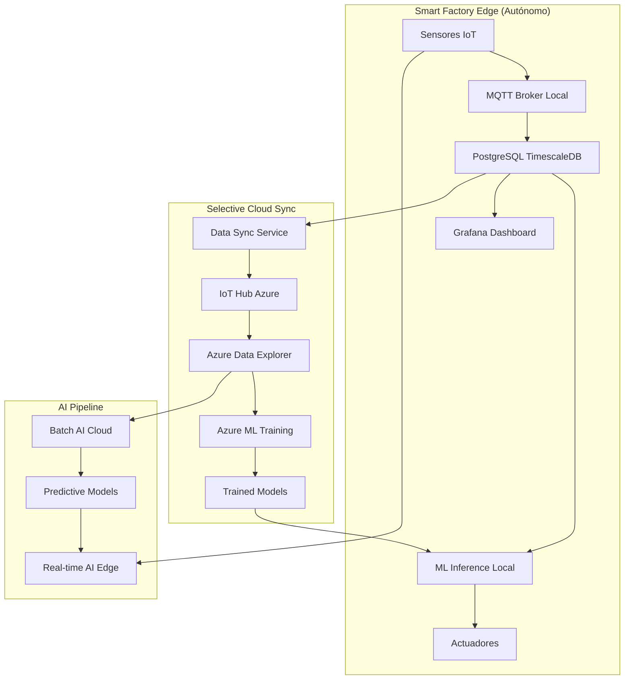

# Smart Factory - Arquitectura Híbrida Edge + Cloud ML

## 🎯 Arquitectura Completa



## 🚀 Componentes & Data Flow

### 🏭 Edge Layer (Autonomía Total)
1. **MQTT Broker** - Eclipse Mosquitto
2. **PostgreSQL + TimescaleDB** - ✅ Ya tenemos
3. **ML Inference** - TensorFlow Lite / ONNX Runtime
4. **Grafana** - Dashboards tiempo real
5. **Data Sync Service** - Selective cloud sync

### 🌐 Cloud Layer (ML Training)
1. **IoT Hub** - Recibe datos históricos selectivos
2. **Azure Data Explorer** - Analytics big data
3. **Azure ML** - Training modelos con historia
4. **Model Registry** - Versioning ML models

### 🤖 AI Stack Completo
```yaml
# Real-time AI (Edge)
- Anomaly Detection: Local models
- Predictive Maintenance: Edge inference
- Quality Control: Computer vision local

# Historical AI (Cloud)
- Long-term predictions: Azure ML
- Pattern recognition: Big data analytics
- Model improvement: Continuous learning
```

## 📊 Data Sync Strategy

### Datos que van al Cloud (Selectivos):
- ✅ Aggregated metrics (por hora/día)
- ✅ Anomalies & alerts
- ✅ Production KPIs
- ❌ Raw sensor data (queda local)

### Datos que bajan del Cloud:
- ✅ Updated ML models
- ✅ Predictive insights
- ✅ Global benchmarks

## 🔧 Implementation Plan

### Fase 1: Edge Foundation ✅
- [x] PostgreSQL TimescaleDB
- [ ] MQTT Broker
- [ ] Basic ML inference

### Fase 2: Cloud Integration
- [ ] IoT Hub setup
- [ ] Data sync service
- [ ] Azure ML workspace

### Fase 3: AI Pipeline
- [ ] Edge AI models
- [ ] Cloud training pipeline
- [ ] Model deployment automation