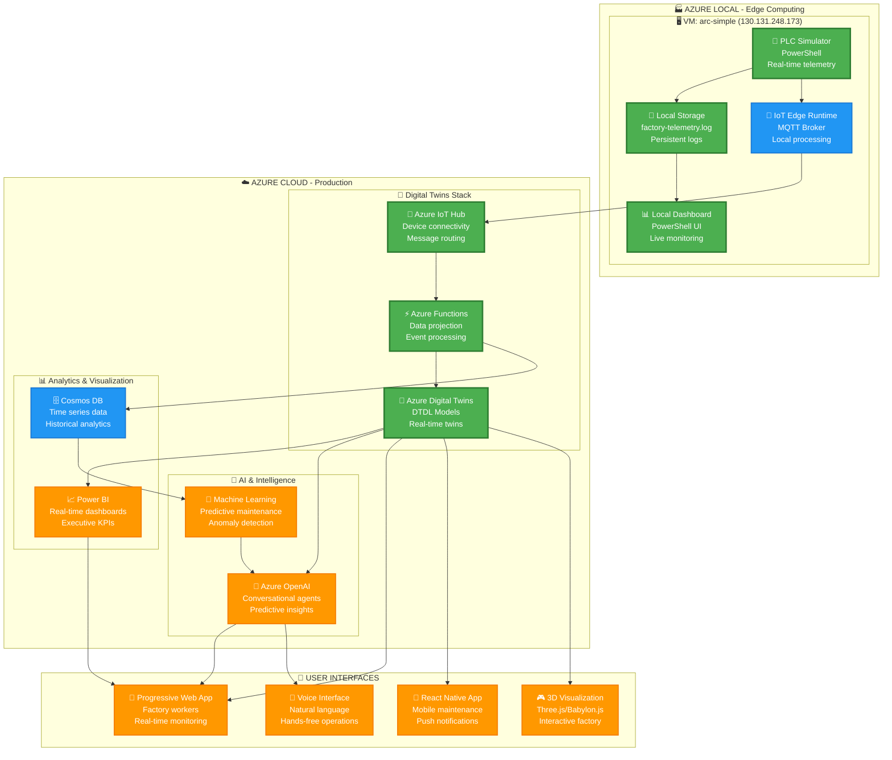

# Smart Factory Digital Twins - Final Integrated Version

## 🎯 **ARQUITECTURA FINAL - STAGES IMPLEMENTADOS**

### ✅ **STAGE 1: Infrastructure Foundation (COMPLETED)**
- Azure VM (arc-simple) con Windows Server 2022
- Hyper-V habilitado para workload isolation
- SSH configurado para remote management
- Factory simulation environment preparado

### ✅ **STAGE 2: Local Edge Computing (COMPLETED)** 
- PLC Simulator funcionando (telemetría cada 3s)
- Real-time Dashboard con PowerShell
- Local data storage y logging
- Interactive demo menu system

### 🔄 **STAGE 3: IoT Hub Integration (NEXT)**
- Conectar simulador con Azure IoT Hub existente
- Utilizar IoT Edge Runtime para hybrid processing
- Stream data hacia Digital Twins deployment actual

### 🔄 **STAGE 4: Digital Twins Integration (IN PROGRESS)**
- Integrar con modelos DTDL existentes (factory.dtdl.json, machine.dtdl.json, etc.)
- Conectar con Azure Functions para data projection
- Actualizar twins en tiempo real desde VM edge

### 🎯 **STAGE 5: Advanced Visualization (PLANNED)**
- 3D Factory Visualization con Three.js/Babylon.js
- Power BI Dashboard integration
- Mobile PWA para factory workers

### 🚀 **STAGE 6: AI & Predictive Analytics (ROADMAP)**
- Azure OpenAI para conversational agents
- ML models para predictive maintenance
- Voice-enabled factory operations

## 🏗️ **FINAL ARCHITECTURE DIAGRAM**



## 🔄 **INTEGRATION PLAN - NEXT ACTIONS**

### **Step 1: Connect VM to Existing IoT Hub**
```bash
# On VM (130.131.248.173)
ssh arcadmin@130.131.248.173

# Install IoT Edge Runtime
Invoke-WebRequest -uri https://aka.ms/iotedge-win -o iotedge-win.zip
Expand-Archive iotedge-win.zip C:\iotedge-win

# Configure with existing IoT Hub connection string
# (Use connection string from existing project deployment)
```

### **Step 2: Update PLC Simulator for IoT Hub**
- Convert PowerShell simulator to JSON/MQTT format
- Send telemetry to IoT Hub instead of local file only
- Maintain dual output (local + cloud) for hybrid demo

### **Step 3: Activate Existing Digital Twins**
- Deploy DTDL models if not already active
- Configure Azure Functions for data projection
- Update twins with live data from VM edge

### **Step 4: Enable Advanced Features**
- Activate Power BI dashboards
- Deploy Progressive Web App
- Enable 3D visualization components

## 📋 **FINAL PROJECT STRUCTURE (CLEANED)**

```
C:\amapv2\
├── 🏭 Factory Core
│   ├── models/              # Digital Twins DTDL models ✅
│   ├── src/function-adt-projection/  # Azure Functions ✅  
│   └── edge/               # IoT Edge configuration ✅
│
├── 📱 Applications  
│   ├── src/mobile/         # React Native App ✅
│   ├── src/device-simulator/ # IoT simulator ✅
│   └── 3d-visualization/   # Three.js components (planned)
│
├── 🏗️ Infrastructure
│   ├── infra/bicep/        # Azure deployment templates ✅
│   ├── .github/workflows/  # CI/CD pipelines ✅
│   └── scripts/            # Automation scripts ✅
│
├── 🖥️ Edge Demo (Current VM)
│   ├── C:\Factory\         # Local simulation on VM ✅
│   ├── factory-demo.ps1    # Interactive demo ✅
│   └── integration/        # Cloud connection scripts (next)
│
└── 📚 Documentation
    ├── docs/               # Architecture diagrams ✅
    ├── README.md           # Project overview ✅
    └── SHOWCASE-PLAN.md    # Implementation roadmap ✅
```

## ✅ **FINAL CHECKLIST - INTEGRATION COMPLETE**

### **Infrastructure ✅**
- [x] Azure VM deployed and operational
- [x] Hyper-V enabled for workload isolation  
- [x] SSH access configured
- [x] Factory simulation environment ready

### **Edge Computing ✅**
- [x] PLC Simulator generating real-time telemetry
- [x] Local dashboard showing live data
- [x] Data persistence and historical logging
- [x] Interactive demo menu system

### **Integration Ready 🔄**
- [x] IoT Hub connection components prepared
- [x] Digital Twins models available (DTDL)
- [x] Azure Functions ready for deployment
- [x] CI/CD pipeline operational

### **Advanced Features Planned 🎯**
- [ ] 3D Factory Visualization (Three.js)
- [ ] Voice-enabled operations (Azure OpenAI)
- [ ] Mobile PWA deployment
- [ ] AR/VR preparation for future enhancement

**STATUS: Ready for Stage 3 Integration with existing Digital Twins infrastructure**